# Архитектура корпоративной учетной системы

## 1. Назначение

Система должна объединять жизненный цикл сотрудника, производственные процессы,
технику, безопасность, проживание, эффективность, мотивацию и отчетность.

Это не только диспетчерская программа и не расширенный Excel. Целевой продукт —
единая корпоративная веб-система, в которой один и тот же факт не вводится
повторно разными отделами.

Excel используется только как временный прототип, источник требований, средство
проверки расчетов и формат импорта/экспорта на переходном этапе. Он не является
целевой базой данных или основным пользовательским интерфейсом.

## 2. Главный принцип

В центре находятся не отделы и не отчеты, а единые сущности компании:

- сотрудник;
- должность и подразделение;
- трудовые отношения;
- смена и назначение на смену;
- техника;
- производственное событие;
- выполненный объем;
- простой и ремонт;
- обучение, адаптация и допуски;
- место проживания;
- показатель эффективности;
- начисление и основание премии;
- документ и согласование.

Каждый отдел видит свою часть этих данных и выполняет свои процессы, но работает
с общим идентификатором сотрудника, техники, смены и события.

### 2.1. Язык системы и документации

Основной язык проекта — русский:

- названия модулей и разделов интерфейса;
- пользовательские таблицы и справочники;
- названия полей и показателей;
- статусы, задачи и уведомления;
- формы ввода и отчеты;
- архитектурные и процессные схемы;
- эксплуатационная документация.

Пользователь не должен встречать в рабочей системе названия вроде `EMPLOYEE`,
`SHIFT_ASSIGNMENT` или `PROCESS_TASK`. На схемах и в интерфейсе используются
понятные названия: «Сотрудник», «Назначение на смену», «Задача процесса».

Внутренние программные идентификаторы могут при необходимости записываться
латиницей, если этого требуют инструменты разработки. Они относятся только к
коду и не должны быть видны обычным пользователям. Для каждого такого
идентификатора ведется однозначное русское название в словаре системы.

## 3. Верхнеуровневая схема

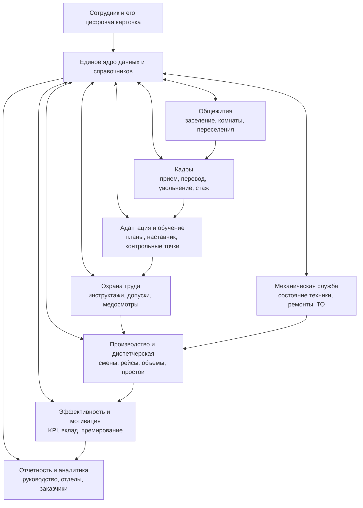

## 4. Сквозной жизненный цикл сотрудника

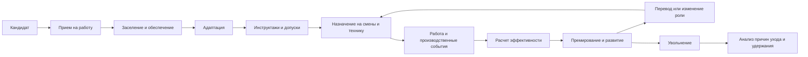

## 5. Модули системы

### 5.1. Базовое ядро

- единые справочники;
- пользователи, роли и права доступа;
- организационная структура;
- карточка сотрудника;
- карточка техники;
- календарь, смены и объекты;
- журнал событий;
- документы и вложения;
- история изменений;
- уведомления и задачи;
- интеграции и импорт данных.

### 5.2. Кадры

- кандидат и прием;
- кадровые документы;
- должности, подразделения и переводы;
- графики и статусы занятости;
- стаж и непрерывность работы;
- увольнение и причины ухода;
- показатели текучести и удержания.

### 5.3. Адаптация, обучение и охрана труда

- программа адаптации по должности;
- наставник;
- контрольные точки и сроки;
- инструктажи;
- обучение и проверка знаний;
- медосмотры;
- удостоверения и допуски;
- запрет назначения на работу без действующего допуска.

### 5.4. Производство и диспетчерская

- сменный отчет;
- назначение водителя или машиниста на технику;
- рейсы и объемы;
- экскаваторный и самосвальный контуры;
- материалы, точки загрузки и разгрузки;
- простои и причины;
- топливо, пробег и моточасы;
- сверка и закрытие смены;
- отчеты для компании и заказчиков.

Уже созданный MVP самосвалов и технические слои `fact_transport_q`,
`calc_transport_enriched_q`, `agg_transport_by_report_calc_q` и
`vw_shift_transport_calc_q` относятся к этому модулю и должны стать источником
производственных фактов, а не отдельной изолированной системой.

### 5.5. Механическая служба

- техническое состояние;
- дефекты и заявки;
- ремонты и техническое обслуживание;
- доступность техники;
- причины технических простоев;
- запчасти и трудозатраты;
- связь ремонта с потерянным производственным временем.

### 5.6. Общежития и обеспечение

- общежития, комнаты и места;
- заселение и выселение;
- история переселений;
- занятость и резерв мест;
- заявки на бытовое обеспечение;
- связь с датой приема, вахтой и увольнением.

### 5.7. Эффективность и мотивация

- персональный производственный вклад;
- качество, безопасность и дисциплина;
- коэффициенты по должностям;
- основания премирования;
- ручные корректировки с обязательным объяснением;
- согласование премий;
- прозрачная расшифровка начисления для каждого сотрудника.

## 6. Ключевые связи данных

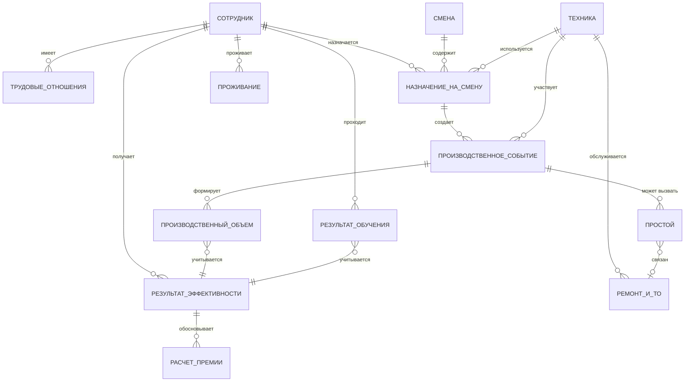

Критическая сущность — «Назначение на смену»: кто, в какую смену, на какой технике,
в какой роли работал. Именно она позволяет корректно связать объемы с конкретным
водителем или машинистом, даже если люди менялись в течение смены.

## 7. Архитектурные слои

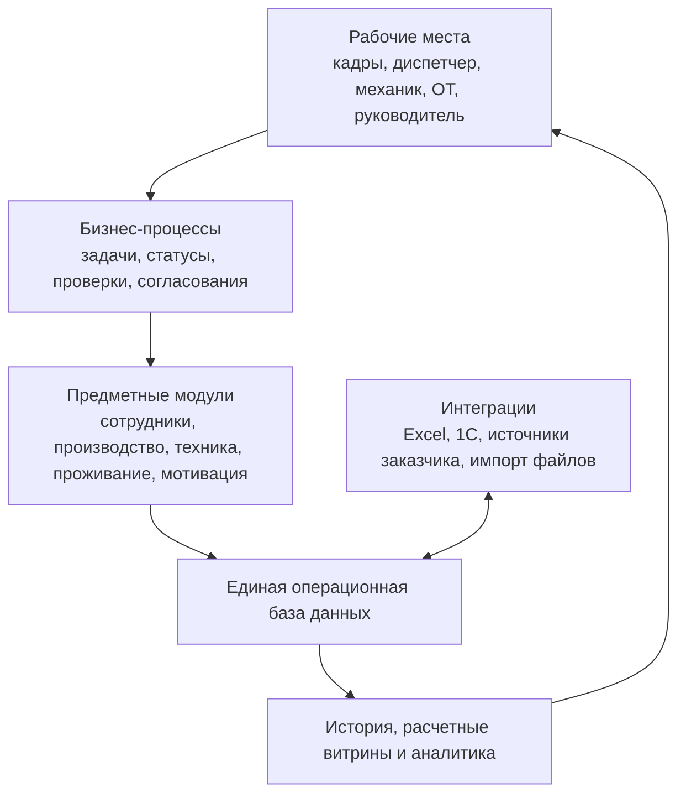

Операционная база хранит текущее состояние и первичные события. Аналитический
слой хранит расчеты, агрегаты и отчетные витрины. Их нельзя смешивать: отчет не
должен становиться местом ручного ввода первичного факта.

## 7.1. Предлагаемый технологический каркас

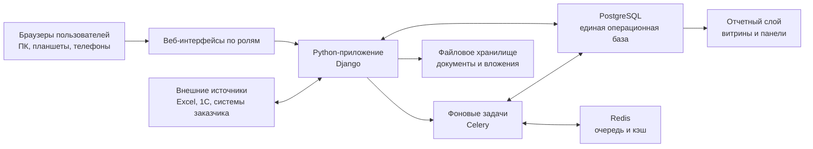

Рекомендуемый стартовый стек:

- Python и Django для бизнес-логики, учетных модулей, пользователей и прав;
- PostgreSQL как единый источник достоверных данных;
- обычный адаптивный веб-интерфейс, работающий через браузер;
- Celery и Redis для тяжелых расчетов, импорта, уведомлений и формирования отчетов;
- отдельное файловое хранилище для документов, сканов и вложений;
- Docker для одинакового запуска на сервере и тестовых средах;
- резервное копирование базы и файлов;
- журналирование всех значимых пользовательских действий.

На первом этапе не требуется создавать отдельное приложение для каждого отдела.
Это должно быть одно веб-приложение с разными рабочими столами, меню и правами:

- кадровый рабочий стол;
- диспетчерский рабочий стол;
- рабочий стол механической службы;
- охрана труда;
- общежития;
- руководитель и аналитика;
- личный кабинет сотрудника в будущем.

Так данные остаются едиными, а интерфейс каждого отдела содержит только нужные
ему процессы.

## 7.2. Развертывание

Целевая схема размещения:

- удаленный Linux-сервер или облачная инфраструктура;
- защищенное HTTPS-подключение;
- доступ извне через VPN или иной контролируемый контур, если система содержит
  кадровые и персональные данные;
- отдельные среды разработки, тестирования и эксплуатации;
- автоматическое резервное копирование;
- мониторинг доступности, ошибок и заполнения диска;
- возможность последующего разделения компонентов без переписывания системы.

Начинать следует с модульного монолита: одного хорошо разделенного Python-
приложения и одной базы PostgreSQL. Микросервисы на старте добавят сложность и не
дадут пользы, пока границы процессов еще уточняются.

## 8. Права доступа

- кадровые и персональные данные доступны только разрешенным ролям;
- медицинские данные и сведения об охране труда имеют отдельные ограничения;
- диспетчер видит необходимые данные назначения, но не всю кадровую карточку;
- руководитель видит показатели подразделения;
- сотрудник может видеть свои задачи, допуски и расшифровку показателей;
- все ручные изменения и корректировки протоколируются.

## 9. Предлагаемый порядок реализации

1. Зафиксировать единое ядро справочников и идентификаторов.
2. Довести производственный MVP до устойчивого сбора фактов по сменам.
3. Добавить назначения сотрудников на технику и привязать объемы к людям.
4. Создать базовую карточку сотрудника и кадровый жизненный цикл.
5. Добавить адаптацию, обучение, инструктажи и допуски.
6. Подключить механику и технические простои.
7. Создать расчет эффективности и прозрачное премирование.
8. Добавить общежития и обеспечение.
9. Перенести отчетные витрины из Excel в общий аналитический слой.

## 10. Ближайший архитектурный результат

До разработки интерфейсов необходимо подготовить четыре согласованных документа:

1. карту подразделений и пользователей;
2. карту сквозных процессов;
3. модель основных сущностей и связей;
4. границы первого промышленного релиза.

Первый релиз не должен охватывать сразу всю компанию. Его разумное ядро:

- сотрудники;
- смены;
- назначения сотрудников на технику;
- производственные события и объемы;
- техника и простои;
- базовые допуски;
- расчет персонального вклада;
- сменная и управленческая отчетность.

## 11. Оперативное планирование и учет работы в смене

### 11.1. Уровни назначения

Связь сотрудника с производством должна состоять из нескольких независимых
уровней. Нельзя хранить одно поле «текущая машина сотрудника», потому что машина,
роль и место работы меняются во времени.

1. **Кадровая принадлежность** — сотрудник принят, имеет должность и подразделение.
2. **Рабочий календарь** — сотруднику назначена дневная или ночная смена на дату.
3. **Допуск к работе** — система проверила действующие документы, обучение и
   разрешенные типы техники.
4. **Сменное назначение** — ответственное лицо назначило сотрудника водителем
   конкретного самосвала или машинистом конкретного экскаватора.
5. **Производственная расстановка** — горный мастер определил, под каким
   экскаватором и на каком участке работает самосвал.
6. **Фактический интервал работы** — зафиксировано время начала и окончания
   работы сотрудника на конкретной машине и машины в конкретной расстановке.
7. **Производственные события** — рейсы, загрузки, разгрузки, смена породы,
   перестановки, простои, заправки и другие факты.

### 11.2. Ответственность за данные

| Действие | Основной ответственный | Результат в ядре |
|---|---|---|
| Создать или закрыть сотрудника | Отдел кадров | Кадровая карточка и статус трудовых отношений |
| Определить рабочий график | Уполномоченный руководитель / кадровая функция | Плановые смены сотрудника |
| Подтвердить обучение и допуски | Охрана труда / обучение | Разрешение на роль и тип техники |
| Назначить водителя на самосвал | Уполномоченный сменный руководитель | Сменное назначение сотрудник–техника |
| Выполнить расстановку под экскаватор | Горный мастер | Плановая производственная расстановка |
| Зафиксировать замену машины или экскаватора | Диспетчер / горный мастер | Новый временной интервал назначения |
| Зафиксировать рейс и материал | Диспетчерский контур или интеграция | Первичное производственное событие |
| Подтвердить закрытие смены | Ответственный диспетчер / руководитель | Зафиксированная версия сменных фактов |
| Рассчитать показатели | Система | Расчетные витрины и персональный вклад |
| Согласовать премирование | Назначенные руководители | Утвержденный расчет премии |

Конкретные должности и права будут уточняться вместе с компанией. Архитектура не
должна жестко зашивать название должности: разрешения назначаются ролям, а роли —
конкретным пользователям и подразделениям.

### 11.3. Сценарий работы водителя самосвала

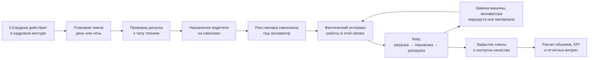

Каждая перестановка не редактирует старое назначение, а завершает предыдущий
интервал и открывает новый. Благодаря этому система может ответить:

- кто фактически управлял машиной в конкретный момент;
- под каким экскаватором она работала;
- какую породу загрузили;
- куда ее доставили;
- сколько рейсов, кубометров и тонн относится к сотруднику, технике и участку;
- сколько времени потеряно и по какой причине;
- кто и когда изменил расстановку.

### 11.4. Основные сущности диспетчерского контура

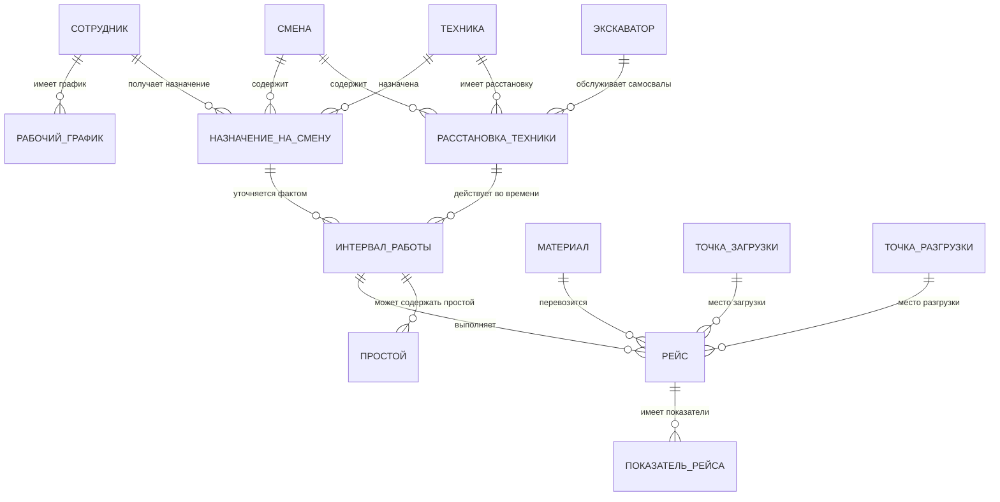

Минимальный состав рейса:

- время загрузки и разгрузки;
- смена и рабочий интервал;
- водитель;
- самосвал;
- экскаватор;
- точка загрузки, горизонт и блок;
- материал или порода;
- точка разгрузки;
- количество рейсов, объем и масса;
- источник данных и статус проверки;
- автор ручного изменения и причина корректировки.

## 12. Потоки данных между модулями и ядром

Модули не должны создавать собственные несвязанные копии сотрудников, техники,
смен и объектов. Они создают или изменяют принадлежащие им данные через единое
ядро и публикуют значимые бизнес-события.

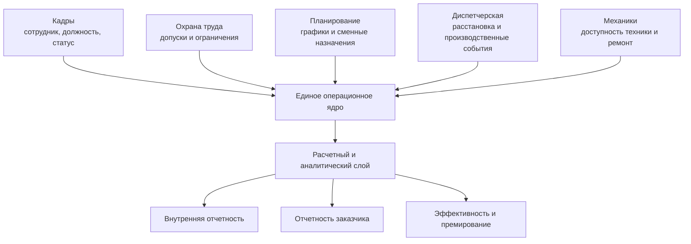

Ядро — не просто место, куда отделы складывают итоговые таблицы. Оно содержит
нормализованные первичные факты, общие справочники, временные интервалы,
ответственных и историю изменений. Отчеты формируются над этими фактами.

## 13. Конструктор отчетов

Конструктор отчетов нужен, но его следует проектировать после стабилизации модели
первичных данных. Он должен работать не напрямую с таблицами операционной базы,
а с утвержденным каталогом отчетных показателей и аналитическими витринами.

Архитектура отчетности:

1. первичные события сохраняются без потери детализации;
2. система рассчитывает единые показатели по утвержденным правилам;
3. для каждого назначения создаются отчетные витрины;
4. пользователю доступны разрешенные измерения, показатели и фильтры;
5. шаблон отчета сохраняется, версионируется и может выгружаться в Excel/PDF;
6. внутренние и заказные отчеты используют одни факты, но разные правила показа,
   группировки и согласования.

Пользователь конструктора не должен иметь возможность случайно изменить формулу
официального показателя. Он выбирает состав и представление отчета, а методика
расчета управляется отдельно и имеет версию и дату действия.

## 14. Результат первого этапа проектирования

Первый этап — это не программирование экранов. Его результатом должен стать
согласованный архитектурный пакет:

1. карта модулей системы;
2. карта ролей и ответственности за данные;
3. каталог основных сущностей;
4. схема потоков данных между отделами;
5. перечень сквозных процессов;
6. правила времени, истории изменений и закрытия периодов;
7. границы модулей и первого промышленного релиза;
8. словарь ключевых терминов компании;
9. черновая модель отчетных показателей;
10. перечень существующих Excel-файлов и систем для миграции.

## 15. Организационная карта системы: ядро и отделы

### 15.1. Принцип взаимодействия

Центральный блок системы — единое ядро. Отделы не передают друг другу отдельные
Excel-файлы и не создают собственные копии общих данных. Каждый отдел работает в
своем модуле:

- создает данные, за которые отвечает;
- получает из ядра данные, необходимые для своей работы;
- изменяет только разрешенную ему часть;
- передает в ядро результаты своих процессов;
- получает задачи, уведомления и показатели от других модулей через ядро.

Сотрудник впервые появляется в системе в кадровом модуле. Уполномоченный работник
отдела кадров создает кандидата или сотрудника и оформляет прием. После
подтверждения приема ядро присваивает сотруднику единый идентификатор. Все
остальные отделы используют этого же сотрудника и не заводят его повторно.

```mermaid
flowchart TB
    CORE["ЕДИНОЕ ЯДРО СИСТЕМЫ\nсотрудники · техника · подразделения · смены\nобъекты · справочники · события · документы\nзадачи · история · права · уведомления"]

    subgraph HR["ОТДЕЛ КАДРОВ"]
        HR1["Кандидат"] --> HR2["Прием на работу"]
        HR2 --> HR3["Должность и подразделение"]
        HR3 --> HR4["Переводы, отпуска, статусы"]
        HR4 --> HR5["Увольнение"]
    end

    subgraph HSE["ОХРАНА ТРУДА И ОБУЧЕНИЕ"]
        HSE1["Программа адаптации"] --> HSE2["Инструктажи"]
        HSE2 --> HSE3["Обучение и проверка знаний"]
        HSE3 --> HSE4["Допуски и ограничения"]
    end

    subgraph PLAN["ПЛАНИРОВАНИЕ ПЕРСОНАЛА"]
        P1["График работы"] --> P2["Дневная или ночная смена"]
        P2 --> P3["Назначение роли в смене"]
        P3 --> P4["Назначение на технику"]
    end

    subgraph OPS["ДИСПЕТЧЕРСКАЯ И ГОРНЫЕ РАБОТЫ"]
        O1["Расстановка техники"] --> O2["Самосвал под экскаватором"]
        O2 --> O3["Рейсы и перевозки"]
        O3 --> O4["Порода и точки разгрузки"]
        O4 --> O5["Простои и изменения"]
        O5 --> O6["Закрытие смены"]
    end

    subgraph MECH["МЕХАНИЧЕСКАЯ СЛУЖБА"]
        M1["Состояние техники"] --> M2["Дефекты и заявки"]
        M2 --> M3["Ремонты и ТО"]
        M3 --> M4["Готовность техники"]
        M4 --> M5["Технические простои"]
    end

    subgraph CAMP["ОБЩЕЖИТИЯ И ОБЕСПЕЧЕНИЕ"]
        C1["Потребность в месте"] --> C2["Заселение"]
        C2 --> C3["Переселение"]
        C3 --> C4["Выселение"]
    end

    subgraph PERF["ЭФФЕКТИВНОСТЬ И ПРЕМИРОВАНИЕ"]
        E1["Производственный вклад"] --> E2["Качество и дисциплина"]
        E2 --> E3["Расчет показателей"]
        E3 --> E4["Согласование премии"]
    end

    subgraph REPORT["ОТЧЕТНОСТЬ И РУКОВОДСТВО"]
        R1["Внутренние отчеты"]
        R2["Отчеты заказчика"]
        R3["Управленческие панели"]
        R4["Конструктор отчетов"]
    end

    HR <--> CORE
    HSE <--> CORE
    PLAN <--> CORE
    OPS <--> CORE
    MECH <--> CORE
    CAMP <--> CORE
    PERF <--> CORE
    REPORT <--> CORE
```

### 15.2. Как сотрудник проходит через отделы

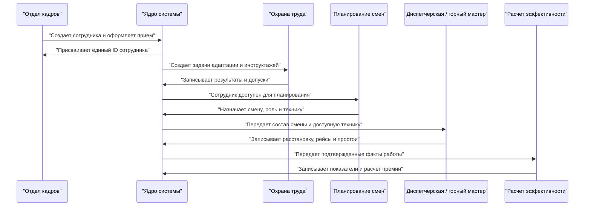

### 15.3. Владельцы основных данных

| Данные | Кто создает и ведет | Кто использует |
|---|---|---|
| Карточка сотрудника | Отдел кадров | Все модули в пределах прав |
| Должность и подразделение | Отдел кадров | Планирование, ОТ, руководство |
| Адаптация и допуски | Охрана труда / обучение | Планирование, диспетчерская |
| Рабочий график и смена | Назначенный ответственный | Диспетчерская, кадры, руководство |
| Назначение на технику | Сменный руководитель | Диспетчерская, механики, аналитика |
| Расстановка техники | Горный мастер | Диспетчерская, руководство |
| Рейсы, объемы и простои | Диспетчерский контур | Аналитика, премирование, заказчик |
| Состояние и ремонт техники | Механическая служба | Диспетчерская, руководство |
| Проживание | Ответственный за общежития | Кадры и обеспечение |
| KPI и премирование | Расчетный модуль и согласующие | Руководство, кадры, сотрудник |
| Формы отчетов | Уполномоченные аналитики | Разрешенные пользователи |

Названия конкретных должностей пока намеренно не зафиксированы. На следующем
этапе для каждого процесса нужно определить фактические роли компании: кто
создает, кто подтверждает, кто может корректировать и кто только просматривает.

## 16. Три состояния жизненного цикла сотрудника

Верхний уровень карточки сотрудника состоит из трех основных состояний:

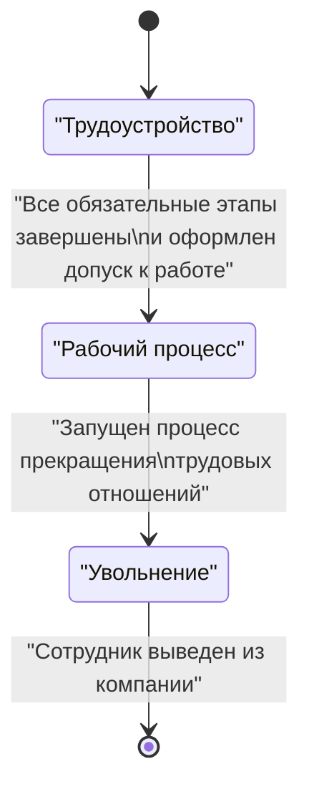

Эти состояния являются крупными процессами, а не одним полем, которое сотрудник
переключает вручную. Состояние рассчитывается системой из завершенных этапов и
официальных решений.

## 17. Состояние «Трудоустройство»: взаимодействие с ядром

### 17.1. Общая логика

С момента появления кандидата ядро создает единую карточку человека. Каждый
последующий участник процесса не заводит новую карточку, а создает связанные с
ней записи: задачу, документ, проверку, поездку, заселение, инструктаж, выдачу или
назначение.

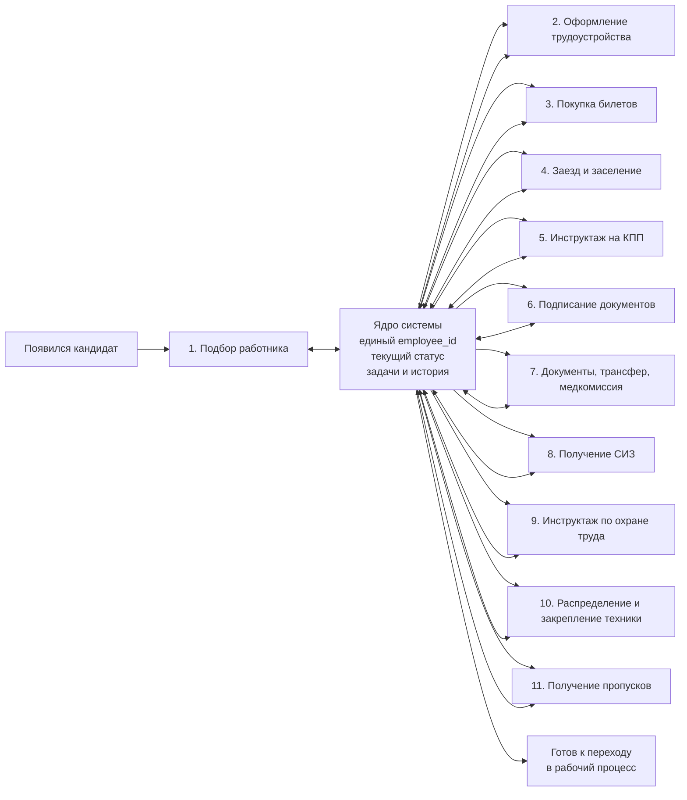

Стрелка к ядру означает сохранение результата этапа. Стрелка от ядра означает
создание следующей задачи, передачу разрешенных данных ответственному и контроль
условий перехода.

### 17.2. Первое появление человека в системе

При подборе сначала создается не «сотрудник», а **кандидат**. Это важно, потому
что не каждый кандидат будет трудоустроен.

Минимальные записи:

```text
ЧЕЛОВЕК
- идентификатор человека
- ФИО
- дата рождения
- контакты
- идентификационные данные с ограниченным доступом

КАРТОЧКА КАНДИДАТА
- идентификатор карточки кандидата
- идентификатор человека
- вакансия
- подразделение и объект
- источник кандидата
- ответственный специалист
- дата создания
- текущий этап
- результат подбора
```

После принятия решения о трудоустройстве создаются:

```text
СОТРУДНИК
- идентификатор сотрудника
- идентификатор человека
- табельный номер
- статус сотрудника

ПРОЦЕСС ТРУДОУСТРОЙСТВА
- идентификатор процесса трудоустройства
- идентификатор сотрудника
- плановая должность
- подразделение
- объект работы
- плановая дата выхода
- текущий этап трудоустройства
- общий процент готовности
- блокирующие проблемы
```

Идентификатор человека не меняется в течение всей его истории. Если бывший сотрудник
вернется в компанию, создается новое трудовое отношение, но не новая личность.

### 17.3. Универсальная запись этапа

Все шаги трудоустройства должны иметь одинаковую служебную структуру:

```text
ЗАДАЧА ПРОЦЕССА
- идентификатор задачи
- идентификатор процесса трудоустройства
- код этапа процесса
- ответственный отдел
- ответственный пользователь
- статус: ожидает / в работе / завершено / отклонено / заблокировано
- плановый срок
- фактическое начало
- фактическое завершение
- результат
- комментарий
- причина отклонения или задержки
- создано кем и когда
- изменено кем и когда
```

Специальные данные этапов хранятся в профильных записях, а «Задача процесса»
связывает их в единый маршрут и показывает текущее состояние процесса.

### 17.4. Что записывает каждый этап

| № | Этап | Что получает из ядра | Что записывает в ядро | Условие завершения |
|---:|---|---|---|---|
| 1 | Подбор работника | Вакансия, требования, подразделение | Карточка кандидата, источник, решение | Кандидат одобрен или отклонен |
| 2 | Трудоустройство | Данные кандидата, вакансия | Employee ID, должность, подразделение, плановая дата выхода | Прием подтвержден ответственным |
| 3 | Покупка билетов | ФИО, маршрут, дата выхода | Билет, маршрут, даты, стоимость, статус поездки | Поездка оформлена |
| 4 | Заезд и заселение | Дата прибытия, объект, потребность в жилье | Факт прибытия, общежитие, комната, место | Сотрудник прибыл и место назначено |
| 5 | Инструктаж на КПП | ФИО, объект, цель допуска | Дата, вид инструктажа, проводивший, результат | Инструктаж пройден |
| 6 | Подписание документов | Комплект документов и шаблоны | Подписанные документы, даты, версии | Обязательный комплект подписан |
| 7 | Документы, трансфер, медкомиссия | Маршрут задач и требования по должности | Переданные документы, трансфер, результаты медкомиссии | Все обязательные подпункты закрыты |
| 8 | Получение СИЗ | Должность, нормы выдачи, размеры | Перечень выданного, количество, дата, получатель | Обязательный комплект СИЗ выдан |
| 9 | Инструктаж по ОТ | Должность, объект, риски | Виды инструктажей, результаты, сроки действия | Обязательные инструктажи действуют |
| 10 | Распределение и закрепление техники | Должность, квалификация, допуски, доступная техника | Подразделение, руководитель, тип или единица техники | Назначение подтверждено |
| 11 | Получение пропусков | Объект, сотрудник, допуски | Номер и тип пропуска, зоны, срок действия | Все необходимые пропуска активны |

Названия ответственных на фотографии предварительные и должны быть подтверждены.
В модели данных хранится не фамилия в коде процесса, а назначенная роль и
конкретный пользователь, выполнивший действие.

### 17.5. Этапы, которые могут идти параллельно

После оформления приема часть задач разумно запускать одновременно:

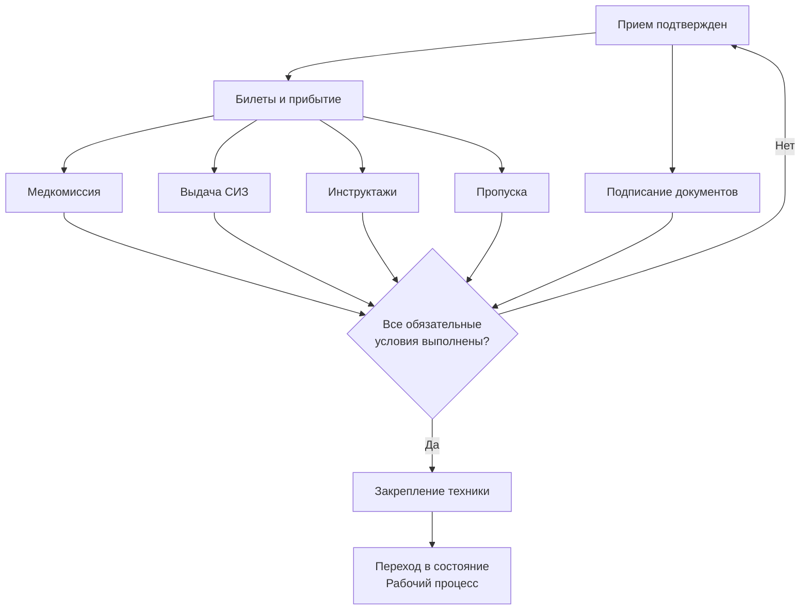

На схеме возврат «Нет» означает сохранение состояния трудоустройства и списка
незавершенных или заблокированных задач, а не повторное оформление приема.

### 17.6. Правило перехода в «Рабочий процесс»

Система переводит сотрудника в рабочее состояние только при выполнении набора
условий, зависящего от должности и объекта. Например, для водителя самосвала:

- трудовые отношения активны;
- сотрудник прибыл на объект;
- обязательные документы подписаны;
- медкомиссия пройдена;
- обязательные СИЗ выданы;
- инструктажи пройдены и действуют;
- необходимые пропуска активны;
- квалификация и право управления подтверждены;
- определено производственное подразделение и руководитель;
- сотрудник доступен для назначения в смену.

Это формируется как настраиваемый **профиль готовности по должности**, а не один
жестко зашитый список для всей компании.

### 17.7. Статусы карточки трудоустройства

Рекомендуемые статусы:

- кандидат создан;
- кандидат одобрен;
- оформление приема;
- ожидается прибытие;
- сотрудник прибыл;
- оформление на объекте;
- ожидаются обязательные допуски;
- готов к производственному назначению;
- трудоустройство завершено;
- процесс приостановлен;
- отказ до выхода;

В карточке всегда должны отображаться текущий этап, процент готовности,
просроченные задачи, блокирующие причины и ответственные лица.

## 18. Состояние «Увольнение»: первичная схема

### 18.1. Исходная цепочка

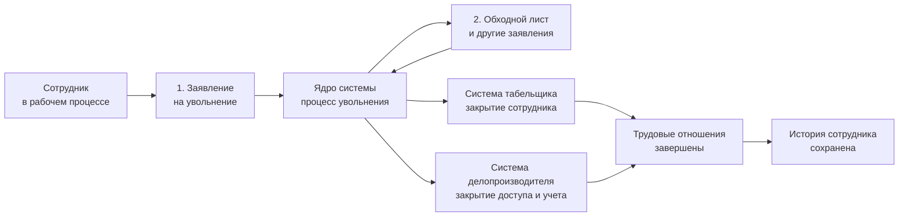

ОУП выступает владельцем процесса увольнения: получает заявление, оформляет
обходной лист и передает подтвержденные сведения в ядро. Ядро создает задачи
табельщику, делопроизводителю и другим участникам процесса.

### 18.2. Что происходит по этапам

| № | Этап | Ответственный | Что записывается в ядро | Результат |
|---:|---|---|---|---|
| 1 | Заявление на увольнение | ОУП | Дата заявления, инициатор, предполагаемая дата увольнения, причина, вложение | Процесс увольнения открыт |
| 2 | Обходной лист и заявления | ОУП и назначенные подразделения | Перечень обязательных согласований, возврат имущества, задолженности, подписи | Обязательства проверены |
| 3 | Передача сведений табельщику | ОУП через ядро | Дата последней смены, дата увольнения, основание | Сотрудник закрыт для будущего табелирования |
| 4 | Передача сведений делопроизводителю | ОУП через ядро | Основание, дата закрытия, список прекращаемых доступов и документов | Доступы и активные процессы закрыты |
| 5 | Завершение трудовых отношений | ОУП | Приказ, фактическая дата, причина, статус завершения | Сотрудник переведен в состояние «Уволен» |

### 18.3. Данные не удаляются

Под «удалением данных из системы табельщика и делопроизводителя» в целевой
архитектуре следует понимать закрытие или деактивацию:

- запрещается назначать сотрудника в новые смены;
- закрывается будущий график и активные назначения;
- блокируется пользовательская учетная запись;
- прекращаются права доступа и активные доверенности;
- закрываются незавершенные задачи или передаются ответственным;
- фиксируется возврат техники, СИЗ, пропусков и имущества;
- сотрудник исключается из списков активного персонала;
- исторические записи остаются доступны согласно правам и срокам хранения.

Нельзя удалять `employee_id`, прошлые смены, рейсы, объемы, начисления, обучение,
документы и историю проживания. Иначе отчеты за прошлые периоды перестанут быть
достоверными.

### 18.4. Записи процесса увольнения

```text
ПРОЦЕСС УВОЛЬНЕНИЯ
- идентификатор процесса увольнения
- идентификатор сотрудника
- инициатор
- дата заявления
- плановая дата увольнения
- фактическая дата увольнения
- причина увольнения
- основание и приказ
- текущий этап
- статус процесса
- блокирующие вопросы

ПУНКТ ОБХОДНОГО ЛИСТА
- идентификатор пункта
- идентификатор процесса увольнения
- подразделение
- вид проверки или имущества
- ответственный
- статус
- результат
- комментарий
- дата подтверждения

ЗАКРЫТИЕ ДОСТУПА
- идентификатор сотрудника
- система или вид доступа
- плановая дата отключения
- фактическая дата отключения
- ответственный
- результат
```

### 18.5. Условия завершения увольнения

Процесс может считаться завершенным, когда:

- заявление и основание зарегистрированы;
- определена фактическая дата увольнения;
- обязательные пункты обходного листа закрыты;
- имущество, СИЗ и пропуска возвращены либо зафиксировано исключение;
- будущие смены и назначения отменены;
- табельщик получил и обработал сведения;
- делопроизводитель и администраторы закрыли необходимые доступы;
- приказ и итоговые документы оформлены;
- трудовое отношение закрыто;
- карточка переведена в архивный статус без удаления истории.

### 18.6. События, которые ядро рассылает подразделениям

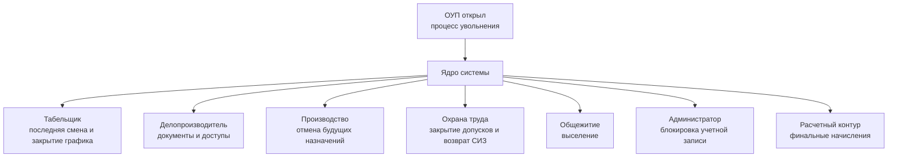

Пока обязательными подтверждены только ОУП, табельщик и делопроизводитель.
Остальные участники показаны как вероятные и должны быть уточнены при дальнейшем
описании процесса.

## 19. Состояние «Рабочий процесс»: сводная схема

### 19.1. Общий принцип

«Рабочий процесс» начинается после завершения трудоустройства и продолжается до
открытия процесса увольнения. В отличие от трудоустройства это не одноразовая
цепочка, а повторяющийся цикл:


Для разных должностей блок «Выполнение рабочих операций» имеет разное
содержание. Для водителя самосвала это рейсы и перевозка; для машиниста
экскаватора — работа экскаватора, загрузка транспорта, изменения места работы и
простои; для механика — заявки, диагностика, ремонт и техническое обслуживание.

### 19.2. Контуры второго состояния

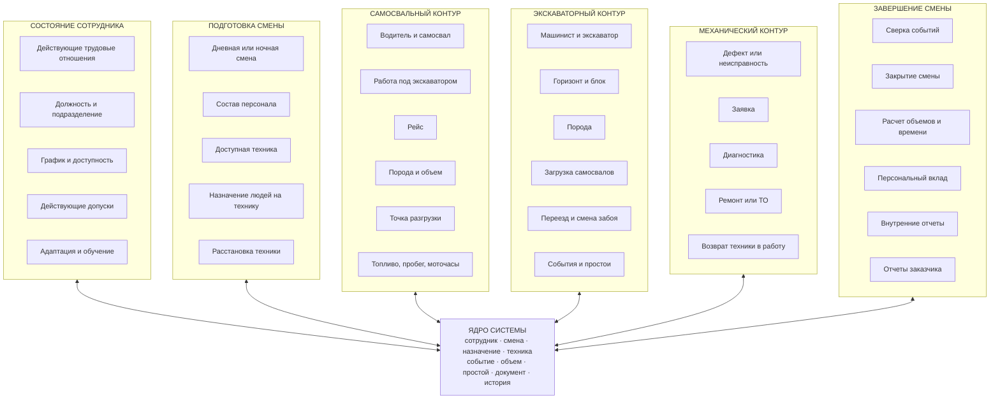

### 19.3. Начало рабочей смены

До назначения сотрудника система проверяет:

- сотрудник активен и не находится в процессе увольнения;
- сотрудник должен работать по графику в эту дату и смену;
- должность и производственная роль соответствуют назначению;
- допуски, медосмотр и инструктажи действуют;
- сотрудник не назначен одновременно в несовместимые места;
- техника существует, доступна и разрешена к эксплуатации;
- у сотрудника есть право работать на этом типе техники.

После проверки создается «Назначение на смену»:

```text
НАЗНАЧЕНИЕ НА СМЕНУ
- сотрудник
- дата и смена
- производственная роль
- подразделение и объект
- назначенная техника
- время начала и окончания
- назначивший пользователь
- статус назначения
- причина изменения или отмены
```

Назначение является планом. Фактическая работа сохраняется отдельными временными
интервалами, поскольку сотрудник может сменить технику внутри одной смены.

### 19.4. Расстановка техники

Горный мастер или иная утвержденная роль создает расстановку:

```text
РАССТАНОВКА ТЕХНИКИ
- дата и смена
- самосвал
- экскаватор
- горизонт
- блок
- порода
- плановая точка разгрузки
- время начала действия
- время окончания действия
- автор расстановки
- причина изменения
```

При перестановке старая запись закрывается временем окончания, а новая запись
создается с новым временем начала. История не перезаписывается.

### 19.5. Самосвальный рабочий цикл

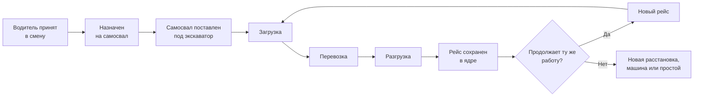

Каждый рейс связывается с:

- водителем;
- самосвалом;
- экскаватором и его машинистом;
- сменой и временным интервалом;
- горизонтом, блоком и точкой загрузки;
- породой или материалом;
- точкой разгрузки;
- числом рейсов, объемом и расчетной массой;
- исходным источником и статусом проверки.

Это позволяет относить один производственный результат одновременно к
сотрудникам, технике, участку, материалу и заказному отчету без повторного ввода.

### 19.6. Экскаваторный рабочий цикл

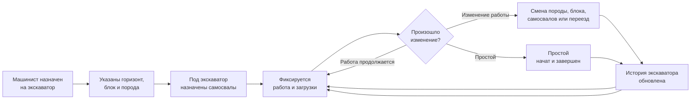

Для экскаватора сохраняются текущие параметры и история их изменений. Один
универсальный экран показывает выбранный экскаватор, но каждая запись в ядре
содержит конкретный экскаватор и действующий временной интервал.

### 19.7. Учет простоев

Простой хранится отдельным событием, а не свободным примечанием к итоговому
отчету:

```text
ПРОСТОЙ
- сотрудник или сотрудники, которых затронул простой
- техника
- дата и смена
- время начала
- время окончания
- продолжительность
- группа причины
- стандартная причина
- подробный комментарий
- производственный или технический характер
- связанная заявка на ремонт
- кто открыл и кто завершил событие
- статус проверки
```

По существующим материалам уже выявлены группы событий: ожидание транспорта,
ремонт и неисправность, перегоны и перемещения, обед, заправка, буровзрывные и
другие горно-технологические работы, зачистка фронта и прочие причины. Итоговый
справочник простоев должен быть единым и управляемым.

### 19.8. Закрытие смены


Проверяются как минимум:

- незакрытые простои и интервалы работы;
- сотрудник без назначения или техника без сотрудника;
- пересекающиеся назначения;
- отсутствующий материал или точка разгрузки;
- несовместимые сведения самосвального и экскаваторного контуров;
- неполный расчет объема или массы;
- ошибки топлива, пробега или моточасов;
- ручные корректировки без причины.

После закрытия смены первичные факты не редактируются обычным способом. Исправление
создается отдельной корректировкой с автором, причиной и новой версией расчета.

### 19.9. Расчет персонального вклада

Из закрытых смен система формирует показатели сотрудника:

- отработанное время и смены;
- выполненные рейсы;
- перевезенный или погруженный объем и массу;
- работа по видам пород и маршрутам;
- производительные и непроизводительные интервалы;
- простои по причинам;
- использование топлива и техники;
- соблюдение требований безопасности;
- подтвержденные нарушения и корректировки;
- показатели адаптации и повышения квалификации;
- стаж и непрерывность работы.

Показатель не должен напрямую становиться премией. Сначала сохраняются факты,
затем рассчитываются показатели по версионным правилам, и только после этого
модуль мотивации применяет утвержденную методику премирования.

### 19.10. Связь с существующими наработками

Существующие наработки проекта входят в эту схему следующим образом:

| Наработка | Место в новой системе |
|---|---|
| Справочник самосвалов | Общий справочник техники |
| Справочник экскаваторов | Общий справочник техники |
| Справочник пород и нормативов | Общий производственный справочник |
| Справочник точек разгрузки | Общий справочник объектов |
| Справочник простоев | Общий справочник производственных событий |
| Самосвальный отчет | Источник первичных рейсов и сменных показателей |
| Экскаваторный журнал | Источник работы, изменений и простоев экскаваторов |
| Расчетный транспортный слой | Основа проверенных расчетных показателей |
| Сменная техническая витрина | Основа закрытия и анализа смены |
| Финальные витрины | Будущий отчетный и аналитический слой |

Названия прежних технических запросов Excel сохраняются только как сведения о
миграции. В пользовательской архитектуре все сущности и разделы называются на
русском языке.

### 19.11. Что пока требует подтверждения

Перед окончательным утверждением второго состояния нужно уточнить:

1. кто составляет график сотрудников;
2. кто назначает водителя или машиниста на конкретную технику;
3. кто имеет право менять назначение внутри смены;
4. кто создает и кто подтверждает расстановку под экскаваторами;
5. кто вводит каждый вид первичных событий;
6. кто закрывает смену;
7. кто имеет право выполнять корректировки после закрытия;
8. какие отчеты обязательны для внутреннего учета и для заказчика;
9. какие процессы механической службы уже существуют фактически;
10. как учитываются отпуска, больничные, межвахта, обучение и временный перевод.

## 20. Персональные веб-интерфейсы и рабочие кабинеты

### 20.1. Общий принцип

Система является одним веб-приложением, но после входа каждый пользователь видит
свой рабочий кабинет. Его состав определяется не вручную написанной отдельной
программой для конкретного человека, а сочетанием параметров:

- подразделение;
- должность;
- рабочая роль в системе;
- объект или участок;
- уровень полномочий;
- назначенные процессы;
- временные замещения;
- индивидуально выданные разрешения.

```mermaid
flowchart LR
    USER["Пользователь входит\nв систему"]
    AUTH["Определение личности\nи учетной записи"]
    ROLE["Роли, должность, отдел,\nобъект и полномочия"]
    DESK["Персональный\nрабочий кабинет"]

    HR["Кадровые задачи"]
    OPS["Смены и производство"]
    MECH["Ремонты и техника"]
    HSE["Инструктажи и допуски"]
    CAMP["Заселение и обеспечение"]
    REPORT["Отчеты и аналитика"]

    USER --> AUTH --> ROLE --> DESK
    ROLE --> HR
    ROLE --> OPS
    ROLE --> MECH
    ROLE --> HSE
    ROLE --> CAMP
    ROLE --> REPORT
```

Пользователь видит только те разделы, записи и действия, которые необходимы ему
для выполнения работы. При этом все кабинеты работают с единым ядром данных.

### 20.2. Не отдельное приложение на каждого человека

Отдельная кодовая версия интерфейса для каждого сотрудника приведет к сотням
вариантов, которые невозможно нормально сопровождать. Поэтому используются:

1. **Общие функциональные модули** — кадры, производство, механика, охрана труда,
   общежития, отчеты.
2. **Рабочие роли** — кадровый специалист, табельщик, диспетчер, горный мастер,
   механик, специалист ОТ, руководитель и другие.
3. **Наборы разрешений** — просмотр, создание, изменение, подтверждение,
   согласование, закрытие периода, экспорт.
4. **Персональная настройка кабинета** — задачи, показатели, быстрые действия и
   уведомления конкретного пользователя.

Один человек может иметь несколько ролей. Например, руководитель может видеть
операционный кабинет подразделения и одновременно согласовывать премирование.

### 20.3. Структура рабочего кабинета

Каждый кабинет формируется из типовых элементов:

- мои задачи и сроки;
- уведомления и блокирующие проблемы;
- быстрые действия;
- рабочие списки и очереди;
- карточки объектов ответственности;
- необходимые формы ввода;
- показатели текущей смены или периода;
- доступные отчеты;
- история собственных действий;
- замещение отсутствующего сотрудника.

### 20.4. Предварительные рабочие кабинеты

| Кабинет | Основные операции |
|---|---|
| Специалист ОУП / кадров | Кандидаты, прием, кадровая карточка, документы, переводы, увольнение |
| Табельщик | Графики, явки, отклонения, закрытие табеля, сведения об увольнении |
| Делопроизводитель | Документы, подписи, регистрация, выдача и закрытие доступов |
| Специалист охраны труда | Инструктажи, обучение, медосмотры, допуски и ограничения |
| Ответственный за СИЗ | Нормы, размеры, выдача, возврат и замена имущества |
| Ответственный за общежития | Места, заселение, переселение и выселение |
| Диспетчер | Состав смены, техника, события, рейсы, простои и закрытие смены |
| Горный мастер | Расстановка техники, забои, блоки, породы и изменения в смене |
| Механическая служба | Дефекты, заявки, ремонты, ТО и готовность техники |
| Руководитель подразделения | Контроль смены, согласования, показатели и отклонения |
| Аналитик | Витрины, шаблоны отчетов, проверка показателей и выгрузки |
| Сотрудник | Личные сведения, график, задачи, допуски и расшифровка показателей |

Список предварительный и будет уточняться по фактической структуре компании.

### 20.5. Пример различий внутри одного отдела

Даже сотрудники одного отдела могут иметь разные интерфейсы:

```mermaid
flowchart TB
    MOD["Модуль производства"]
    DISP["Диспетчер\nвводит и контролирует события"]
    MASTER["Горный мастер\nвыполняет расстановку"]
    HEAD["Руководитель\nподтверждает и анализирует"]
    ANALYST["Аналитик\nработает с отчетами"]

    MOD --> DISP
    MOD --> MASTER
    MOD --> HEAD
    MOD --> ANALYST
```

Таким образом, граница интерфейса проходит не только по отделу, но и по роли и
операционной задаче.

### 20.6. Права на действия и данные

Для каждого раздела отдельно задается:

- какие записи пользователь может видеть;
- какие поля доступны ему для просмотра;
- что он может создавать;
- что может редактировать до подтверждения;
- что может подтверждать или согласовывать;
- может ли исправлять данные закрытого периода;
- может ли экспортировать сведения;
- может ли видеть персональные, медицинские или финансовые данные.

Например, диспетчер может видеть ФИО, табельный номер, роль, смену и допуск
водителя, но не обязан видеть паспортные данные, адрес или кадровые документы.

### 20.7. Маршрутизация задач

Ядро должно назначать задачи не только конкретному человеку, но и рабочей роли.
Это позволяет не останавливать процесс во время отпуска или болезни специалиста.

Пример:

```text
Задача: выдать комплект СИЗ
Получатель: роль «Ответственный за выдачу СИЗ»
Подразделение: объект «Долина»
Срок: до даты выхода сотрудника
Исполнитель: определяется из дежурства или принимает задачу из общей очереди
```

После принятия задачи система фиксирует конкретного исполнителя и все его
действия.

### 20.8. Требования к интерфейсам

- работа через обычный браузер без установки отдельных программ;
- адаптация под компьютер, планшет и при необходимости телефон;
- минимальное число действий для частых операций;
- разные стартовые страницы для разных ролей;
- единый внешний стиль и одинаковые принципы управления;
- поиск по разрешенным данным;
- понятные статусы и причины блокировки;
- сохранение черновиков;
- защита от двойного ввода и случайного повторного подтверждения;
- журнал действий пользователя;
- возможность дальнейшего подключения мобильного приложения без изменения ядра.
