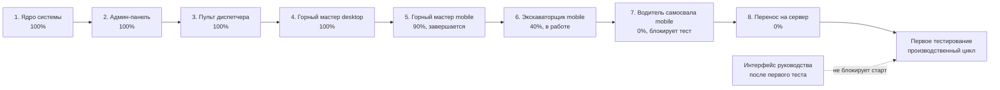

# Дорожная карта до первого тестирования

Дата фиксации: 29.06.2026.

Документ нужен для короткого объяснения руководителю, где сейчас находится проект, что уже собрано, что осталось до первого тестирования и какие работы не блокируют старт теста.

## Краткая картина

Система уже прошла этап создания основы и основных диспетчерско-административных рабочих мест. Сейчас работа находится в финальной части полевого контура: нужно закрыть мобильные интерфейсы Экскаваторщика и Водителя самосвала, затем перенести проект на сервер и начинать первое тестирование производственного цикла.

Для начала тестирования не нужно ждать интерфейс Руководства и полную управленческую витрину. Они идут после проверки основного производственного потока.

## Прогресс по крупным блокам

| Блок | Статус | Готовность | Что означает |
|---|---:|---:|---|
| Ядро системы | Готово | 100% | Основная модель, роли, смены, техника, рейсы, базовая логика учета |
| Админ-панель | Готова | 100% | Сотрудники, доступы, справочники, административный контур |
| Пульт диспетчера | Готов | 100% | Основной рабочий desktop-пульт управления сменой |
| Горный мастер, desktop | Готов | 100% | Desktop-пульт горного мастера соответствует рабочей механике |
| Горный мастер, mobile | Завершается | 90% | Основная мобильная механика собрана, идет доводка и стабилизация |
| Экскаваторщик, mobile | В работе | 40% | Первый мобильный shell перенесен в Django, нужны серверные события и доводка сценариев |
| Водитель самосвала, mobile | Не начат | 0% | Обязательный блок до первого тестирования |
| Интерфейс руководства | Не начат | 0% | Не блокирует первый производственный тест, нужен для последующего управленческого слоя |
| Перенос на сервер | Предстоит | 0% | Нужен перед тестированием вне локального компьютера |

## Цветовая декомпозиция по очередности работ

В HTML-версии дорожной карты основная визуализация сделана как одна сегментированная шкала. Каждый сегмент соответствует этапу работы до первого тестирования, выполненная часть сегмента закрашивается цветом, а невыполненная часть остается белой с видимой границей сетки. Этап самого тестирования и интерфейс Руководства не включены в полосу, чтобы шкала показывала именно оставшийся путь до старта теста. Внизу крупно указан управленческий статус готовности проекта к первому тестированию: 85%.

| Очередь | Этап | Цвет на схеме | Готовность | Смысл |
|---:|---|---|---:|---|
| 1 | Ядро системы | синий | 100% | Основа учета, роли, смены, техника, рейсы |
| 2 | Админ-панель | бирюзовый | 100% | Управление сотрудниками, доступами и справочниками |
| 3 | Пульт диспетчера | зеленый | 100% | Основное рабочее место управления сменой |
| 4 | Горный мастер desktop | темно-зеленый | 100% | Desktop-пульт горного мастера |
| 5 | Горный мастер mobile | желтый | 90% | Завершается сейчас, идет стабилизация мобильной механики |
| 6 | Экскаваторщик mobile | оранжевый | 40% | В работе, нужно завершить серверные сценарии и смену |
| 7 | Водитель самосвала mobile | красный | 0% | Не начат, обязательный блок до тестирования |
| 8 | Перенос на сервер | фиолетовый | 0% | Инфраструктурный этап перед тестированием |

Общий процент в руководительской версии не является арифметическим средним по внутренним задачам. Он показывает управленческую готовность проекта к первому тестированию: ключевая основа уже собрана, управленческие рабочие места готовы, мобильный Горный мастер завершается, а до тестирования остаются два критичных шага - довести полевые мобильные роли и перенести проект на сервер. Поэтому на отправляемой схеме используется статус 85%, а детальная готовность отдельных этапов остается внутри сегментов шкалы.

Длительность сегментов на шкале уточнена 30.06.2026 по фактическому опыту разработки: ядро заняло около 6 дней, админка около 5 дней, мобильная версия Горного мастера около 4 дней, рабочие интерфейсы в среднем занимают по 2-4 дня. Текущие веса сегментов: ядро 6 дней, админка 5 дней, диспетчер 3,5 дня, Горный мастер desktop 2,5 дня, Горный мастер mobile 4 дня, Экскаваторщик 3,5 дня, Водитель самосвала 3 дня, сервер 2 дня.

## Последовательность до первого тестирования

## Декомпозиция для объяснения руководителю

### Уже сделано

- Ядро учета и роли.
- Админ-панель.
- Пульт диспетчера.
- Горный мастер desktop.

### Сейчас в работе

- Финальная доводка мобильного Горного мастера.
- Завершение мобильного Экскаваторщика.
- Подготовка связки полевых ролей.

### Блокирует первый тест

- Мобильный Водитель самосвала.
- Сквозная проверка ролей: Диспетчер / Горный мастер / Экскаваторщик / Водитель.
- Перенос проекта на сервер.

### После первого теста

- Интерфейс руководства.
- Расширенная управленческая аналитика.
- Дополнительные отчеты и улучшения по замечаниям пилота.

## Что нужно доделать именно для старта тестирования

1. Завершить мобильный пульт Горного мастера.
2. Довести мобильный интерфейс Экскаваторщика до рабочего тестового состояния.
3. Сделать мобильный интерфейс Водителя самосвала.
4. Проверить связку ролей в одном производственном сценарии: Диспетчер / Горный мастер / Экскаваторщик / Водитель.
5. Перенести проект на сервер и подготовить тестовый доступ.
6. Провести первый тестовый прогон с фиксацией замечаний.

## Предварительная оценка времени

Оценка дана для одного разработчика при фокусной работе над первым тестовым запуском, без включения интерфейса Руководства, расширенной аналитики и дополнительных отчетов.

| Блок | Оценка |
|---|---:|
| Финальная доводка мобильного Горного мастера | 0,5-1,5 рабочих дня |
| Доведение мобильного Экскаваторщика до тестового состояния | 2-3 рабочих дня |
| Создание мобильного Водителя самосвала | 2-3 рабочих дня |
| Сквозная проверка ролей и исправление первичных связок | 1-2 рабочих дня |
| Перенос проекта на сервер и проверка доступа | 1-3 рабочих дня |
| Резерв на ошибки, правки после первого прогона и непредвиденные связки | 2-4 рабочих дня |

Итого до первого тестирования:

- оптимистично: 7-9 рабочих дней;
- реалистично: 10-14 рабочих дней;
- с учетом серверных сюрпризов и дополнительных правок: до 14-18 рабочих дней.

Календарно это ориентировочно 2 рабочие недели при нормальной загрузке и без резкой смены состава MVP.

## Что уже можно показывать как выполненную основу

- Ядро учета и роли уже созданы.
- Административный контур готов как рабочее место управления сотрудниками, доступами и справочниками.
- Диспетчерский пульт готов как основное рабочее место управления сменой.
- Desktop-пульт Горного мастера готов.
- Mobile-пульт Горного мастера находится в финальной доводке, а не в стадии концепции.
- Экскаваторщик уже начат и перенесен в код, но требует завершения серверных сценариев событий, смены и проверки на тестовых данных.

## Как объяснять руководителю одной фразой

Проект уже прошел стадию создания ядра и основных рабочих мест управления; до первого тестирования осталось закрыть два полевых мобильных рабочих места, завершить мобильного Горного мастера и перенести систему на сервер.

## Что не нужно включать в критический путь первого теста

- Полный интерфейс руководства.
- Расширенная управленческая аналитика.
- Дополнительные отчеты после первичного производственного сценария.
- Полная промышленная эксплуатация с доработками по результатам пилота.

Эти блоки важны для следующего этапа, но они не должны задерживать первый тест производственного контура.
