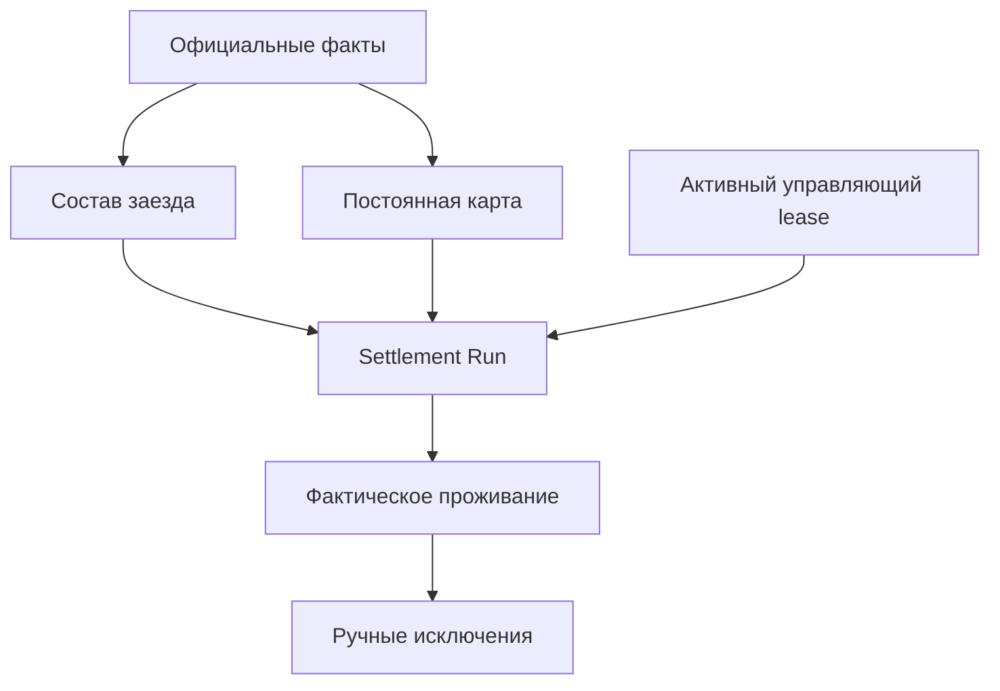
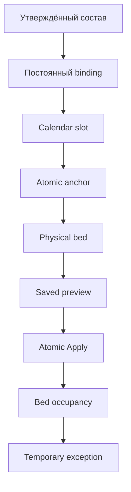

# Целевая архитектура и модель данных

Версия: 0.5
Статус: целевая логическая модель; физическая реализация выполняется поэтапно после фиксации комплекта

## 1. Архитектурный принцип

Система разделяется на шесть независимых слоёв:

1. официальные входные факты;
2. постоянная жилищная карта;
3. план конкретного заезда;
4. фактическое проживание;
5. исключительное управление write-контуром;
6. решения и аудит.

Ни один слой не должен подменять другой. В частности, оперативное назначение на технику не является постоянным жилищным правом, а preview не является фактическим заселением.

## 2. Сохраняемые существующие сущности

Если актуальный код подтверждает их корректность, сохраняются:

- `PhysicalRoom` — физическая комната;
- `PhysicalBed` — физическая койка;
- `SettlementSource` — источник решения;
- `SettlementRevision` — неизменяемая версия источника;
- `AccommodationAnchor` — атомарное жилищное место;
- `AccommodationAnchorBedAssignment` — периодическая связь атомарного места с физической койкой;
- `EmployeeBedOccupancy` — фактическое проживание на конечном интервале.

Сохранение названия не означает сохранение ошибочной семантики. Актуальные constraints и writers должны быть приведены к этой документации.

## 3. Атомарное жилищное место

`AccommodationAnchor` всегда обозначает одно атомарное место, способное одновременно указывать не более чем на одну физическую койку.

Минимально необходимые атрибуты:

| Поле | Смысл |
|---|---|
| `stable_id` | Неизменяемая внешняя идентичность |
| `anchor_type` | `EQUIPMENT`, `FUNCTION`, `GROUP`, `RESERVE`, `SERVICE`, `PROTECTED` |
| `group_key` | Логическая группа, например ID техники или код функции |
| `ordinal` | Номер атомарного места внутри группы; существующее поле HEAD используется повторно |
| `status` | Проект/подтверждено/закрыто |
| `source_revision` | Основание создания или изменения |

Для тяжёлой техники обязательны два атомарных anchor:

- `(equipment_id, ordinal=1)`;
- `(equipment_id, ordinal=2)`.

Они группируются одной техникой, но каждый связан с отдельной койкой. Ограничение «одна техника — один anchor» запрещено.

Аудит HEAD подтвердил, что `Equipment 1:N AccommodationAnchor` уже допускается, а `ordinal` уже существует. Поэтому базовое решение — не добавлять родитель `EquipmentAccommodationPair`, пока реальная потребность не доказана. Пара определяется общей Equipment и двумя active anchors с ordinal 1/2. Бизнес-смысл остаётся: одна техника — пара, пара — два атомарных места.

Необходимые ограничения:

- active equipment anchor имеет заполненный `equipment` и не использует function/group keys;
- для одной Equipment не более одного active anchor каждого ordinal;
- для технической пары разрешены только ordinal 1 и 2;
- подтверждение жилищной карты требует наличия обоих slots;
- обе bed assignments пары ведут в одну room и одинаковый position `n`, но разные blocks A/B.

## 4. Календарный слот атомарного места

Новая логическая сущность `AccommodationAnchorCalendarSlot`:

| Поле | Смысл |
|---|---|
| `anchor_id` | Атомарное жилищное место |
| `watch_composition_id` | Стабильный ID официальной `WatchComposition`, а не её название или производный признак |
| `valid_from`, `valid_to` | Период действия календарного слота |
| `status` | Проект/подтверждено/закрыто |
| `source_revision_id` | Основание |

Одна физическая койка может обслуживать календарные слоты разных чередующихся групп, потому что их фактические периоды проживания не пересекаются. Если непересечение не доказано календарём, Apply блокируется.

## 5. Постоянное закрепление сотрудника

Новая сущность `EmployeeAccommodationBinding` хранит постоянное жилищное право:

| Поле | Смысл |
|---|---|
| `employee_id` | Сотрудник |
| `anchor_calendar_slot_id` | Календарный слот атомарного места |
| `valid_from`, `valid_to` | Период действия права |
| `status` | `DRAFT`, `CONFIRMED`, `CLOSED` |
| `basis_type`, `basis_id` | Основание: утверждённый baseline, решение руководителя и т. п. |
| `basis_snapshot` | Неизменяемый снимок опубликованного CrewPlan/EquipmentAssignment либо решения руководителя на момент создания |
| `source_revision_id` | Неизменяемая версия источника |
| `approved_by`, `approved_at` | Подтверждение |
| `supersedes_id` | Предыдущее закрепление при постоянной коррекции |

Инварианты:

- сотрудник не имеет двух пересекающихся подтверждённых binding;
- один календарный слот не имеет двух пересекающихся подтверждённых владельцев;
- временная occupancy не закрывает binding;
- изменение binding выполняется отдельной командой и не маскируется под relocate.

## 6. Состав заезда

`SettlementCohort` является сохраняемой жилищной проекцией официального состава конкретного заезда. Она не заменяет кадровый источник: система собирает её из `WatchComposition`, `WatchPeriod`, подтверждённых решений/откликов ротации, утверждённых продлений и ручных подтверждённых поправок. Аудит HEAD не обнаружил готового полноценного источника, поэтому целевая реализация включает отдельные версионируемые записи cohort.

`SettlementCohort`:

- период;
- ссылка на `WatchComposition`;
- статус `DRAFT`, `APPROVED`, `SUPERSEDED`;
- номер версии;
- источник;
- кто зафиксировал жилищную версию;
- отпечаток содержимого.

`SettlementCohortMember`:

- сотрудник;
- `[arrival_at, departure_at)`;
- статус участия;
- причина изменения;
- ожидаемый schedule regime;
- ссылка на официальный источник;
- производственный контекст как snapshot, но не как постоянное право.

Изменение членства в `WatchComposition` выполняется ОУП/кадровым процессом. Делопроизводитель вправе зафиксировать новую жилищную версию состава, не переписывая исходные кадровые факты.

## 7. Различие постоянного и оперативного назначения

Отдельный постоянный производственный план для расселения не вводится.

Если у сотрудника нет подтверждённого `EmployeeAccommodationBinding`, обычный опубликованный `CrewPlan` и созданный из него действующий `EquipmentAssignment` могут предложить первичную техническую группу и атомарное место. При Apply делопроизводитель одновременно создаёт binding и occupancy, а система сохраняет снимок использованного плана, назначения и ревизии.

Если binding уже существует, он имеет приоритет. Любые последующие `EquipmentAssignment` считаются оперативным контекстом и не могут сами изменить binding. Постоянный перевод выполняется отдельной командой изменения binding с решением уполномоченного руководителя; временное переселение создаёт только конечную occupancy-override.

## 8. Фактическое проживание

`EmployeeBedOccupancy` хранит только факт/план фактического проживания на конечном интервале:

| Поле | Смысл |
|---|---|
| `employee_id` | Сотрудник |
| `physical_bed_id` | Койка |
| `starts_at`, `ends_at` | Обязательный конечный интервал |
| `terminated_at` | Отдельный факт досрочного прекращения, не переписывающий исходный план |
| `occupancy_kind` | `BINDING`, `TEMPORARY_OVERRIDE`, `EMERGENCY` |
| `binding_id` | Постоянное основание, если применимо |
| `cohort_member_id` | Строка состава заезда |
| `run_row_id` | Строка Apply, если создано автоматически |
| `source_revision_id` | Основание |
| `created_by` | Автор |

Ключевые решения:

- бессрочный тип `PERMANENT` не используется вместо постоянного binding;
- auto-preview не создаёт `PROPOSED occupancy`;
- предложение хранится в `AutoSettlementRunRow`;
- существующие значения `PERMANENT/TEMPORARY/PROPOSED`, если они есть в HEAD, требуют миграционного аудита, а не слепого продолжения.

## 9. Профиль использования комнаты

Для периода должна существовать подтверждённая политика комнаты — новая сущность либо вычислимый версионируемый профиль:

`RoomUseProfile`:

- room;
- период;
- gender policy;
- schedule regime `EARLY/STANDARD/SPECIAL`;
- organization class `STAFF/CONTRACTOR/MIXED_BY_EXCEPTION`;
- protected/reserve/service flags;
- правило 2+1 и ориентация для технической комнаты;
- источник и ревизия.

Профиль действует для комнаты целиком на заданном периоде. Текущий режим фиксируется мастером, диспетчером либо другим уполномоченным участником процесса; settlement не вычисляет его по зашитым часам. DAY/NIGHT сотрудника хранится отдельно как рабочий контекст и не является значением EARLY/STANDARD комнаты. Reserve/service eligibility не удерживает пустую комнату без действующих закреплений или состава; protected-флаг, напротив, исключает фонд из общего использования. Номера специальных комнат, включая комнаты 36–38 из старых материалов, загружаются как актуальная конфигурация и не зашиваются в код. Неизвестный применимый профиль блокирует автоматическое заселение.

## 10. Явные категории и временные статусы

`SettlementCategory` хранит версионируемое определение явной жилищной категории, например `RESERVE`. Категория сама по себе не резервирует пустой физический фонд.

`EmployeeSettlementCategoryAssignment`:

| Поле | Смысл |
|---|---|
| `employee_id`, `category_id` | Кому и какая категория назначена |
| `assignment_kind` | `PERMANENT` или `TEMPORARY` |
| `valid_from`, `valid_to` | Период действия; для временного назначения `valid_to` обязательно |
| `status` | `DRAFT`, `CONFIRMED`, `CLOSED` |
| `source_revision_id` | Неизменяемое основание |
| `approved_by`, `approved_at` | Кто и когда назначил |
| `supersedes_id` | История постоянного изменения |

Отсутствие `EquipmentAssignment` не создаёт категорию автоматически. Временная работа на технике не закрывает категорию и binding; постоянный перевод закрывает назначение отдельной командой.

Стажировка моделируется официальным временным статусом сотрудника/кадрового процесса и ссылкой на подтверждённую целевую вакансию или будущую позицию. Она не является `SettlementCategory` и не получает отдельные anchors или физический пул. Если действующей целевой вакансии нет, resolver возвращает конфликт.

## 11. Resolver-правила

`SettlementResolverRule` — версионируемая конфигурация категорий без прямой пары техники:

- priority;
- employee predicate;
- target anchor type/group;
- eligible pool;
- hard constraints;
- soft preferences и deterministic ranking;
- совместимость групп при заполнении неполной комнаты;
- период действия;
- source revision.

Маршрутизация нового сотрудника разделена на две оси. Сначала вычисляется пересечение допустимых фондов по полу, работодателю/подрядчику и protected-правам. Затем внутри этого фонда определяется жилищная группа: подтверждённая будущая позиция стажёра → явная категория → опубликованная техника → официальная должность/служба → конфликт. Явная категория резерва имеет приоритет над временной работой на технике. Существующий binding обрабатывается до resolver.

В конфигурации фиксируются технические и функциональные группы: типы тяжёлой техники; помощники машиниста экскаватора; лёгковой транспорт и «Газели»; отдельные вахтовки/автобусы; механическая служба вместе с тягачом; совместимая группа мужских АСУ ГТК и ОТ/ПБ/БДД; мужские ИТР по службам; мужские диспетчеры, горные мастера и оперативное руководство. Женский пол маршрутизирует сотрудницу в общий женский фонд до служебной группировки.

Число техники, должности, фамилии и номера комнат являются данными. Например, две комнаты для шести бульдозеров появляются из шести действующих единиц реестра и правила «три пары на комнату», а не из константы `6` в коде.

## 12. Сохраняемый расчёт

`AutoSettlementRun`:

- cohort/version;
- target period;
- rule version;
- input hash;
- status `CALCULATED`, `STALE`, `APPLYING`, `APPLIED`, `CANCELLED`, `FAILED`;
- calculated_by/at;
- applied_by/at;
- idempotency key и результат Apply.

`AutoSettlementRunRow`:

- employee/cohort member;
- action `KEEP`, `SETTLE`, `SETTLE_NEW_BINDING`, `CONFLICT`;
- proposed binding/anchor/bed;
- snapshot официальных входов;
- reason codes;
- source trace;
- row input hash;
- applied occupancy/binding IDs после Apply.

Строки после расчёта неизменяемы. Новый расчёт создаёт новый run.

`AutoSettlementRunConflict` агрегирует конфликт на уровне группы:

- код и тип жилищной группы;
- требуемое и доступное количество мест;
- величина дефицита;
- затронутые строки run;
- нарушенные жёсткие правила и проверенные пулы.

Конфликт неизменяем вместе с run. Расчёт не выбирает из конфликтной группы сотрудников, которых следует исключить. До решения уполномоченного руководителя вся неделимая конфликтная часть остаётся неприменённой.

`SettlementConflictDecision` хранится отдельно:

- ссылка на исходный conflict;
- тип решения: явный приоритет подмножества, альтернативное размещение, изменение состава через официальный процесс либо разрешённая ручная операция;
- явно перечисленные затронутые сотрудники;
- основание, комментарий, автор и время;
- source revision и ссылка на новый run/команду.

Решение не переписывает исходный run и не меняет кадровый cohort молча. Оно становится явным входом нового расчёта либо отдельной доменной команды.

## 12A. Исключительное управление settlement write-контуром

Новая singleton-сущность `SettlementControlLease` не заменяет `EmployeeAccess`, а доказывает, какая серверная сессия сейчас вправе изменять расселение.

| Поле | Смысл |
|---|---|
| `scope` | Константа единственного глобального settlement-контура |
| `owner_access` | Nullable FK на действующий `EmployeeAccess` управляющего; сотрудник и роль определяются только через этот access |
| `owner_session_hash` | Необратимый идентификатор серверной сессии без хранения cookie |
| `lease_token` | Отдельный непрогнозируемый UUID конкретного владения; не является session hash |
| `fencing_revision` | Неотрицательный монотонно возрастающий номер владения; сохраняется в состоянии FREE |
| `acquired_at`, `heartbeat_at`, `expires_at` | Начало, подтверждение активности и конечный срок lease |
| `created_at`, `updated_at` | Время создания singleton row и последнего изменения текущего состояния |

`SettlementControlLease` хранит только текущее состояние и не содержит отдельных полей сотрудника, роли или истории завершения и перехвата. Сотрудник и роль текущего владельца определяются через `owner_access`, а история переходов хранится только в `SettlementControlEvent`.

Инварианты:

- в БД существует одна строка control scope, поэтому двух активных владельцев быть не может;
- состояние FREE требует `owner_access=NULL`, пустой `owner_session_hash`, `lease_token=NULL` и `acquired_at/heartbeat_at/expires_at=NULL`; `fencing_revision` при освобождении не сбрасывается;
- состояние HELD требует заполненные `owner_access`, `owner_session_hash`, `lease_token`, `acquired_at`, `heartbeat_at`, `expires_at`; связанный `owner_access` должен быть действующим и иметь роль `settlement_clerk` либо `admin`;
- для HELD выполняется `heartbeat_at >= acquired_at` и `expires_at > heartbeat_at`; частично заполненное состояние запрещено;
- acquire и takeover сначала блокируют singleton row через `SELECT FOR UPDATE`, затем блокируют `Employee` владельца и его `EmployeeAccess` в общем кадровом порядке и повторно проверяют связь, активность и роль; heartbeat, release и обычный expire, изменяющие только уже заблокированную lease-row, не обязаны искусственно блокировать `Employee` или `EmployeeAccess`;
- acquire создаёт новый `lease_token`; release и expiry очищают активные поля, увеличивают `fencing_revision` и создают соответственно `RELEASED` либо `EXPIRED`; takeover атомарно заменяет `owner_access`, session hash, token и timestamps, увеличивает revision и создаёт `TAKEN_OVER`;
- каждый изменяющий запрос перед доменными блокировками блокирует эту же строку и в той же транзакции сверяет access, session hash, `lease_token`, срок и `fencing_revision`; до первой блокировки `EmployeeAccess` write gate обязан неблокирующим чтением построить полный lock plan всех участвующих `Employee` и `EmployeeAccess`, а если полный план получить нельзя — прекратить операцию fail-closed;
- старый token после release, takeover, expiry или нового acquire никогда не может выполнить запись, даже если прежняя HTTP-сессия ещё существует;
- несколько запросов одной владеющей сессии сериализуются на control row и затем используют общий доменный lock order;
- администратор выполняет takeover как смену владельца, а не как обход lease или доменных проверок;
- второй делопроизводитель и администратор могут читать карту и диагностический preview без lease, пока операция не резервирует и не изменяет данные;
- точный heartbeat interval и timeout являются конфигурацией эксплуатации, но всегда конечны и фиксируются в аудите.

Стабильные ошибки write-boundary: `settlement_control_required`, `settlement_control_lost`, `settlement_control_taken_over`. Они возвращаются до частичной доменной записи.

Вся история управления хранится только в отдельном неизменяемом журнале `SettlementControlEvent`. Стабильный enum содержит ровно четыре значения: `ACQUIRED`, `RELEASED`, `EXPIRED`, `TAKEN_OVER`. Каждое событие сохраняет nullable `actor_access` для системного `EXPIRED`, nullable `previous_owner_access` и `new_owner_access` согласно переходу, `occurred_at`, `source`, предыдущую и новую `fencing_revision`, безопасную `session_metadata` без открытого session key и `reason`; `new_fencing_revision` всегда больше `previous_fencing_revision`, а для `TAKEN_OVER` причина обязательна. Heartbeat обновляет только lease timestamps и не создаёт отдельное audit-событие при каждом продлении.

UI реализуется как расширение существующей карты v29 без её переписывания. Существующие комнаты, койки, поиск, счётчики, DnD и guards сохраняются. Поверх них добавляются индикатор владельца, acquire/release, read-only banner, административный просмотр без lease, подтверждаемый takeover с обязательной причиной и уведомление прежней сессии. Серверный write gate, а не состояние кнопок, окончательно запрещает запись без действующих token и revision.

## 13. Единый доменный валидатор

Все ручные и автоматические writers используют один набор жёстких правил в двух режимах:

- `PRECHECK` — диагностический, без резервирования;
- `COMMIT` — повторная проверка под блокировками внутри транзакции.

PRECHECK никогда не является разрешительным токеном.

COMMIT проверяет минимум:

- актуальность cohort, binding, room profile, anchor-bed и transfer status;
- пересечение койки;
- пересечение сотрудника;
- пол;
- режим комнаты;
- организационное разделение;
- protected/reserve права;
- календарную группу;
- правило 2+1;
- подтверждённую целевую вакансию стажёра;
- актуальность явной категории;
- конкуренцию строк одного run;
- обязательные источники и ревизии.

## 14. Транзакции и конкурентность

Apply и ручные settlement writers выполняются одной транзакцией. Общий стабильный порядок блокировок:

1. singleton `SettlementControlLease` и проверка fencing revision;
2. предварительное неблокирующее определение полного набора идентификаторов;
3. все участвующие `Employee` по возрастанию PK;
4. все участвующие `EmployeeAccess` по возрастанию PK;
5. повторная проверка связей `EmployeeAccess.employee_id`, активности Employee/Access, разрешённой роли и остальных условий;
6. `AutoSettlementRun`, cohort и их версии, если команда относится к Apply;
7. `PhysicalBed` по возрастанию PK;
8. `PhysicalRoom` по возрастанию PK;
9. anchor/calendar slots/bindings в установленном для операции порядке;
10. пересекающиеся `EmployeeBedOccupancy` по возрастанию PK.

Полный набор `Employee` определяется до блокировки первого `EmployeeAccess` и включает владельца lease/оператора, сотрудника операции, отличный от него `settled_by`/actor и всех сотрудников пакетного Apply. Порядок `Employee(A) → EmployeeAccess(A) → Employee(B)` запрещён: сначала блокируются все строки `Employee`, затем все строки `EmployeeAccess`. После блокировки первого `EmployeeAccess` добавлять новые Employee-locks нельзя.

Если `employee_id` первоначально известен только через `EmployeeAccess`, предварительный объект читается без блокировки и используется только для построения плана. После блокировки соответствующего `Employee`, затем `EmployeeAccess` связь и состояние перечитываются; предварительный объект не является окончательно достоверным. Запрос `EmployeeAccess` с `select_related` блокирует только сам `EmployeeAccess` через эквивалент `select_for_update(of=('self',))`; joined `Employee` и `Role` используются только для чтения. Отдельная блокировка `Role` допустима только при реальной необходимости и после `EmployeeAccess`.

Вложенные `settle_employee_on_bed()`, `relocate_employee_to_bed()` и `release_employee_from_bed()` работают внутри внешней транзакции gate и используют уже заблокированный набор либо повторно выбирают только те же строки без расширения Employee-набора. OUP, login/activation, кадровые переводы и batch writers, затрагивающие обе кадровые модели, применяют тот же префикс «все `Employee` по PK → все `EmployeeAccess` по PK → повторная проверка», но без `SettlementControlLease`.

После блокировок входы перечитываются и пересчитывается hash. Любое устаревание, изменение связи Access→Employee либо появление ранее неизвестного участника прекращает транзакцию без частичной записи.

Acquire использует порядок `Lease → Employee владельца → EmployeeAccess владельца`; takeover — `Lease → Employee администратора → EmployeeAccess администратора`. Поэтому takeover ждёт завершения уже начатого writer, затем увеличивает revision; старый владелец не может начать следующую запись. Heartbeat, release и обычный expire ограничиваются уже заблокированной lease-row, если не читают и не меняют кадровые строки. Lease уменьшает достижимость конкуренции между операторами, но не заменяет доменные row locks и PostgreSQL constraints.

Запрещены writers через `bulk_create`, `QuerySet.update` или обход доменного COMMIT-валидатора для подтверждённых settlement-сущностей.

## 15. Трассировка целевого потока

Это основная вертикаль модуля. Пока любой обязательный переход отсутствует, модуль нельзя считать завершённым.
