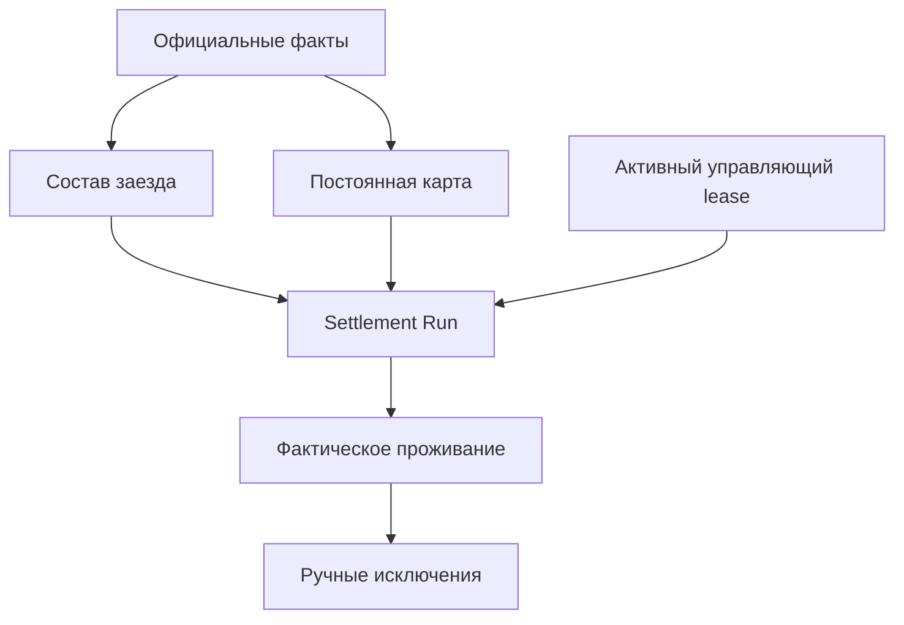
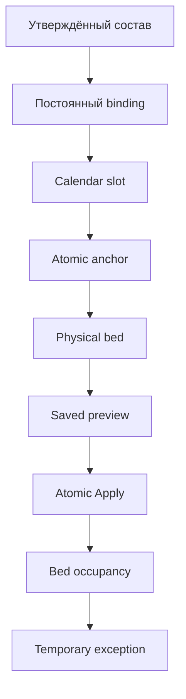

# Целевая архитектура и модель данных

Версия: 0.6
Статус: целевая логическая модель; физическая реализация выполняется поэтапно после фиксации комплекта

## Реализованное развитие ADR-031

Migration `assignments.0007_equipment_assignment_provenance` добавила доказуемое происхождение официального назначения: только `deputy_published_plan` с точным `source_crew_plan_slot` считается официальным. Публичные `save/create/bulk_create/update/bulk_update` не позволяют создать или подменить такое происхождение; прежние назначения остаются `unverified`.

Migration `settlement.0015_cohort_member_work_shift` добавила `SettlementCohortMember.work_shift` и неизменяемое происхождение смены. Для внутреннего жильца оно связано с единственным официальным `EquipmentAssignment`, для внешнего — с точным доступом делопроизводителя, временем и основанием. Эти сведения входят в M6, M7 и нормализованные отпечатки.

Migration `settlement.0016_shift_scoped_apply_and_occupancy` перевела применение плана на независимые дневную и ночную команды и добавила сменную идентичность фактическому проживанию. `SettlementPreviewApplication` связан с запуском через FK, хранит `work_shift`, а уникальность `(preview_run, work_shift)` обеспечивает одну запись применения каждой смены. Исторические записи без смены не угадываются.

## 1. Архитектурный принцип

Система разделяется на шесть независимых слоёв:

1. официальные входные факты;
2. постоянная жилищная карта;
3. план конкретного заезда;
4. фактическое проживание;
5. исключительное управление write-контуром;
6. решения и аудит.

Ни один слой не должен подменять другой. В частности, оперативное назначение на технику не является постоянным жилищным правом, а preview не является фактическим заселением.

## 2. Сохраняемые существующие сущности

Если актуальный код подтверждает их корректность, сохраняются:

- `PhysicalRoom` — физическая комната;
- `PhysicalBed` — физическая койка;
- `SettlementSource` — источник решения;
- `SettlementRevision` — неизменяемая версия источника;
- `AccommodationAnchor` — атомарное жилищное место;
- `AccommodationAnchorBedAssignment` — периодическая связь атомарного места с физической койкой;
- `EmployeeBedOccupancy` — фактическое проживание на конечном интервале.

Сохранение названия не означает сохранение ошибочной семантики. Актуальные constraints и writers должны быть приведены к этой документации.

## 3. Атомарное жилищное место

`AccommodationAnchor` всегда обозначает одно атомарное место, способное одновременно указывать не более чем на одну физическую койку.

Минимально необходимые атрибуты:

| Поле | Смысл |
|---|---|
| `stable_id` | Неизменяемая внешняя идентичность |
| `anchor_type` | `EQUIPMENT`, `FUNCTION`, `GROUP`, `RESERVE`, `SERVICE`, `PROTECTED` |
| `group_key` | Логическая группа, например ID техники или код функции |
| `ordinal` | Номер атомарного места внутри группы; существующее поле HEAD используется повторно |
| `status` | Проект/подтверждено/закрыто |
| `source_revision` | Основание создания или изменения |

Для тяжёлой техники обязательны два атомарных anchor:

- `(equipment_id, ordinal=1)`;
- `(equipment_id, ordinal=2)`.

Они группируются одной техникой, но каждый связан с отдельной койкой. Ограничение «одна техника — один anchor» запрещено.

Аудит HEAD подтвердил, что `Equipment 1:N AccommodationAnchor` уже допускается, а `ordinal` уже существует. Поэтому базовое решение — не добавлять родитель `EquipmentAccommodationPair`, пока реальная потребность не доказана. Пара определяется общей Equipment и двумя active anchors с ordinal 1/2. Бизнес-смысл остаётся: одна техника — пара, пара — два атомарных места.

Необходимые ограничения:

- active equipment anchor имеет заполненный `equipment` и не использует function/group keys;
- для одной Equipment не более одного active anchor каждого ordinal;
- для технической пары разрешены только ordinal 1 и 2;
- подтверждение жилищной карты требует наличия обоих slots;
- обе bed assignments пары ведут в одну room и одинаковый position `n`, но разные blocks A/B.

## 4. Календарный слот атомарного места

Новая логическая сущность `AccommodationAnchorCalendarSlot`:

| Поле | Смысл |
|---|---|
| `anchor_id` | Атомарное жилищное место |
| `watch_composition_id` | Стабильный ID официальной `WatchComposition`, а не её название или производный признак |
| `watch_period_id` | Обязательный конкретный `WatchPeriod`; один slot не переносится между периодами |
| `valid_from`, `valid_to` | Неизменяемый снимок включительных `starts_on/ends_on` связанного WatchPeriod |
| `status` | Проект/подтверждено/закрыто |
| `source_revision_id` | Основание |

Deterministic identity: `(anchor_id, watch_period_id)`. `WatchPeriod.watch_composition_id` обязан совпадать с явно сохранённым `watch_composition_id`, а `valid_from/valid_to` — точно с `starts_on/ends_on`; любое несовпадение отклоняется fail-closed. Сохранённые границы не переписываются при последующем изменении WatchPeriod: расхождение означает stale relation и запрещает новое подтверждение или коррекцию.

Одна физическая койка может обслуживать slots разных чередующихся групп только при доказанном непересечении конкретных WatchPeriod. Пересекающиеся подтверждённые slots одного физического места запрещены независимо от DAY/NIGHT, названия смены или WatchComposition. Для следующего WatchPeriod создаётся новая строка slot. Долгосрочное повторяемое правило относится к M5/M6.

## 5. Постоянное закрепление resident

Новая сущность `EmployeeAccommodationBinding` хранит постоянное жилищное право:

| Поле | Смысл |
|---|---|
| `resident_id` | Единый субъект расселения `SettlementResident` |
| `anchor_calendar_slot_id` | Календарный слот атомарного места |
| `valid_from`, `valid_to` | Период действия права |
| `status` | `DRAFT`, `CONFIRMED`, `CLOSED` |
| `basis_type`, `basis_id` | Основание: утверждённый baseline, решение руководителя и т. п. |
| `basis_snapshot` | Неизменяемый снимок опубликованного CrewPlan/EquipmentAssignment либо решения руководителя на момент создания |
| `source_revision_id` | Неизменяемая версия источника |
| `approved_by`, `approved_at` | Actor/audit: корпоративный `Employee`, подтвердивший операцию |
| `supersedes_id` | Предыдущее закрепление при постоянной коррекции |

Инварианты:

- resident не имеет двух пересекающихся подтверждённых binding;
- один календарный слот не имеет двух пересекающихся подтверждённых владельцев;
- временная occupancy не закрывает binding;
- изменение binding выполняется отдельной командой и не маскируется под relocate.

## 5A. Общий settlement subject

Migration `settlement.0010_settlement_residents` ввела `SettlementResident` как общую identity потенциального жильца со стабильным идентификатором, типом, lifecycle `ACTIVE/ARCHIVED`, optimistic revision и provenance exact `EmployeeAccess` делопроизводителя для внешних карточек.

- `EMPLOYEE`: обязательная уникальная защищённая связь с `Employee`; внешние карточные поля не являются кадровым источником;
- `CONTRACTOR`, `BUSINESS_TRIP`, `EXTERNAL_OTHER`: `Employee` отсутствует, обязательны ФИО, должность/профессия, организация, телефон и authoritative `external_sex=male/female`, фотография необязательна;
- организация внешнего жильца хранится нормализованным текстом; отдельный employer-справочник на этом этапе не создаётся;
- внешняя карточка не создаёт login, PIN, `Role` или `EmployeeAccess` и может повторно использоваться в следующих заездах;
- физическое удаление через публичный domain API запрещено; source/type неизменяемы, update/archive/reactivate требуют control lease, exact session access и `expected_revision`.

Migration `settlement.0011_resident_subject_transition` завершила schema/domain-переход M4/M5: `EmployeeAccommodationBinding` и `SettlementCohortMember` ссылаются на `SettlementResident` через `PROTECT`, а прямого subject-FK на `Employee` больше нет. Actor/audit-поля остаются FK на корпоративный `Employee`. Internal resident обязан ссылаться на активного Employee и получает кадровые сведения и `WatchComposition` только из него; external resident не имеет Employee и не получает выдуманную корпоративную composition. Последующая migration `settlement.0013_resident_occupancy_subject` завершила тот же subject transition для фактической occupancy, а M8 добавил resident-based Apply. UI внешней карточки и UI ручного внешнего заселения этими переходами не создаются.

## 6. Состав заезда

Целевой вход M5 — одна версионная сущность реестра заезда и её строки. ОУП, Табельщик, Заместитель начальника участка и Делопроизводитель получают разные фильтрованные представления одних строк; копирование списка между модулями запрещено. Следующая версия ссылается на предшествующую и сохраняет автора, время, источник, SHA-256 файла и причины изменений.

Принято целевое распределение ответственности `TIMEKEEPER_OWNER`. ОУП при
трудоустройстве создаёт карточку и фиксирует первоначальные график, бригаду и
вахту, меняет должность при кадровом переводе, увольняет или архивирует
сотрудника. Табельщик владеет версиями общего календаря фаз и на официальном
основании меняет график, бригаду или вахту действующего сотрудника. Заместитель
начальника участка назначает конкретные `DAY/NIGHT` и технику через
опубликованные `CrewPlanSlot` и `EquipmentAssignment`. Делопроизводитель только
потребляет эти сведения для расселения. Ни одна из ролей не подменяет решение
другой роли.

Каждая строка связана с точным `SettlementResident` и хранит участие, даты прибытия/выбытия, состояние обработки и ссылки на доказательства. Для внутреннего жильца связь с `Employee` существует только через `SettlementResident`; для внешнего жильца сохраняются собственные обязательные сведения без создания кадровой карточки и системного доступа.

Подтверждённая версия становится общей основой двух последующих представлений:

- очередь Заместителя начальника участка содержит только строки, которым требуются техника, роль и официальная смена;
- очередь Делопроизводителя содержит только строки, достигшие состояния «Готов к расселению» либо «Требуется проверка» с объяснимой причиной.

Значение смены из исходного файла не является официальным. Канонические
правила потребления подтверждённой календарной фазы при T3 и авторосселении
зафиксированы в документе
[`Централизованная перевахтовка 2026 года`](../../docs/domain/ЦЕНТРАЛИЗОВАННАЯ_ПЕРЕВАХТОВКА_2026.md).
Календарная фаза — ожидаемое состояние бригады `DAY/NIGHT/OFF`, а
производственное назначение — решение Заместителя начальника участка о
конкретных `DAY/NIGHT` и технике. Для производственного жильца окончательным
источником смены являются точные опубликованные `CrewPlanSlot` и
`EquipmentAssignment`; календарная фаза проверяет их согласованность. При
расхождении система не выбирает источник автоматически и возвращает
`requires_review`. Для внутреннего непроизводственного жильца без обязательной
расстановки смена берётся только по подтверждённой тройке
`WorkSchedule + brigade_number + WatchPeriod`. `OFF` означает межвахту и не
включается автоматически в прибывающий состав. Для внешнего жильца без
`Employee`, `WorkSchedule` и `brigade_number` календарь смену не определяет, а
Делопроизводитель не подменяет отсутствующий источник догадкой.

`SettlementCohort` является сохраняемой жилищной проекцией официального состава конкретного заезда. Она не заменяет кадровый источник: система собирает её из `WatchComposition`, `WatchPeriod`, подтверждённых решений/откликов ротации, утверждённых продлений и ручных подтверждённых поправок. Аудит HEAD не обнаружил готового полноценного источника, поэтому целевая реализация включает отдельные версионируемые записи cohort.

`SettlementCohort`:

- период;
- ссылка на `WatchComposition`;
- статус `DRAFT`, `APPROVED`, `SUPERSEDED`;
- номер версии;
- источник;
- кто зафиксировал жилищную версию;
- отпечаток содержимого.

`SettlementCohortMember`:

- `resident_id` — внутренний или внешний `SettlementResident`;
- `[arrival_at, departure_at)`;
- статус участия;
- причина изменения;
- ожидаемый schedule regime;
- обязательная authoritative смена DAY/NIGHT с источником и результатом сверки;
- ссылка на официальный источник;
- производственный контекст как snapshot, но не как постоянное право.

Первоначальные кадровые сведения при трудоустройстве фиксирует ОУП. Изменение
`WorkSchedule`, `brigade_number` или принадлежности действующего сотрудника к
вахте по заявлению либо иному официальному основанию является целевой
ответственностью Табельщика. Версию единого реестра заезда и версии календаря
фаз подтверждает Табельщик; Делопроизводитель получает готовый результат и не
переписывает кадровые факты, календарь или производственную расстановку.

### 6.1. Реализованный фундамент T1.1–T1.3b

T1.1 безопасно хранит исходный Excel и SHA-256 вне публичного каталога, сохраняет исходные и нормализованные строки, предварительное сопоставление и вопросы без записи в `Employee`, `EmployeeAccess`, `SettlementResident`, `EquipmentAssignment`, M4–M9 или фактическое проживание. Excel является дополнительным источником сверки.

T1.2 хранит ручные решения отдельно от неизменяемых исходных строк и записывает точный доступ табельщика, серверное время и события. Табельщик может выбрать существующего жильца, участие, способ прибытия, даты и основание, но не закрывает вопросы ОУП, делопроизводителя, заместителя начальника участка или повреждённого файла.

T1.3a формирует новую версию из кадровой базы `Employee`, которая является основным источником внутреннего состава. `ArrivalRosterPoolRow` сохраняет точный FK сотрудника даже при отсутствии `SettlementResident`; повторное формирование создаёт новую версию и новый канонический отпечаток, не переписывая историю. T1.3b предоставляет раздел «Рабочее место табельщика → Перевахта и состав заезда», поиск по всей базе сотрудников, добавление существующей внешней карточки и идемпотентное массовое подтверждение однозначных строк.

В текущем реализованном контуре Табельщик читает кадровые карточки обеих вахт,
новых и уволенных, но ещё не изменяет их. Целевое изменение графика, бригады и
вахты действующего сотрудника требует отдельной проверки и реализации. Writer
и UI календаря фаз Табельщика также ещё не реализованы; существующие права
кода нельзя выдавать за уже приведённые в соответствие с `TIMEKEEPER_OWNER`.
Рабочий телефон доступен только для служебной подготовки билетов и трансфера;
он не входит в URL, события, снимки, отпечатки или технические журналы.
Внешняя карточка не получает фиктивных `Employee`, `EmployeeAccess`, роли или
`WatchComposition`.

T1.1–T1.3b имеют статус `COMPLETE` локально. T1.4 окончательного утверждения, безопасная замена предыдущей подтверждённой версии, `SettlementSource`/`SettlementRevision`, T2, T3, черновой `SettlementCohort`, полный модуль табельщика и production deployment остаются `NEXT`.

## 7. Различие постоянного и оперативного назначения

Отдельный постоянный производственный план для расселения не вводится.

Если у внутреннего resident нет подтверждённого `EmployeeAccommodationBinding`, обычный опубликованный `CrewPlan` и созданный из него действующий `EquipmentAssignment` могут предложить первичную техническую группу и атомарное место. Реализованный M8 Apply применяет только сохранённый подтверждённый результат M6/M7 и сохраняет его provenance; для external resident корпоративное назначение на технику или `WatchComposition` не синтезируется.

Если binding уже существует, он имеет приоритет. Любые последующие `EquipmentAssignment` считаются оперативным контекстом и не могут сами изменить binding. Постоянный перевод выполняется отдельной командой изменения binding с решением уполномоченного руководителя; временное переселение создаёт только конечную occupancy-override.

Реализованное read-only ядро M6 применяет волны `CONFIRMED binding → EquipmentAssignment → PersonnelPosition → controlled unresolved`. Equipment wave принимает ровно одно действующее `EquipmentAssignment` (`ACCEPTED`, `role IS NOT NULL`, `shift IS NULL`, применимый assigned/accepted/ended interval на начало WatchPeriod), затем требует active Equipment, ровно один active `AccommodationAnchor` типа equipment, ровно один effective `CONFIRMED` `AccommodationAnchorBedAssignment` и `CONFIRMED` `AccommodationAnchorCalendarSlot` того же WatchPeriod. Fingerprint нормализованного результата включает PK и ревизионно-статусный контекст assignment, Equipment, anchor, anchor-bed assignment, slot и PhysicalBed. Никакая неоднозначность не разрешается сортировкой или выбором первой строки.

`shift_type` и DAY/NIGHT не входят в identity PhysicalBed. Если два resident без нормативного приоритета приводят к одной койке, обе строки получают controlled `hard_rule_conflict`; equipment route имеет приоритет над PersonnelPosition, а подтверждённый binding — над equipment route.

## 8. Фактическое проживание

`EmployeeBedOccupancy` сохраняет legacy-имя класса, но хранит факт/план проживания `SettlementResident` на конечном интервале. Прямого subject-FK на `Employee` больше нет:

| Поле | Смысл |
|---|---|
| `resident_id` | Обязательный внутренний или внешний `SettlementResident` |
| `physical_bed_id` | Койка |
| `starts_at`, `ends_at` | Обязательный конечный интервал |
| `terminated_at` | Отдельный факт досрочного прекращения, не переписывающий исходный план |
| `occupancy_kind` | `BINDING`, `TEMPORARY_OVERRIDE`, `EMERGENCY` |
| `binding_id` | Постоянное основание, если применимо |
| `cohort_member_id` | Строка состава заезда |
| `run_row_id` | Строка Apply, если создано автоматически |
| `source_revision_id` | Основание |

Uniqueness, overlap и interval guards используют `resident_id`. `settled_by` и другие actor/audit FK остаются ссылками на `Employee`; это автор действия, а не subject проживания.

Канонические доменные команды — `settle_resident_on_bed`, `relocate_resident_to_bed`, `release_resident_from_bed`. Заселение принимает точный `resident_id`; переселение и освобождение принимают точный `occupancy_id`. Employee-based entrypoints сохранены только как совместимые адаптеры и не создают жильца скрыто. UI внешней карточки и ручного внешнего заселения пока отсутствует.

Новое ручное проживание внутреннего жильца создаётся только после применения соответствующей смены. Сервер по текущей локальной дате находит ровно одну сменную запись применения, блокирует `WatchPeriod/Application`, повторно проверяет официальное назначение и сохраняет `watch_period`, `work_shift`, точный `EquipmentAssignment` и отпечаток источника. Нулевая или неоднозначная выборка завершается контролируемой ошибкой. Переселение сохраняет период, смену и происхождение исходной заблокированной строки; освобождение закрывает только переданный PK. Историческую строку без проверенной смены разрешено освободить, но запрещено переселять.

Authoritative sex internal resident читается только из `Employee.sex`; поле `external_sex` у internal resident обязано быть пустым. External resident обязан иметь `external_sex` со значением `male` или `female`. Неизвестное значение fail-closed блокирует room compatibility. Изменение внешнего пола, несовместимое с открытой occupancy, запрещено; допустимое изменение меняет M6 fingerprint и переводит ранее сохранённый M7 preview в stale.

Migration `settlement.0013_resident_occupancy_subject` зависит от `settlement.0012_m7_saved_previews`. Forward создаёт или переиспользует internal resident wrappers для существующих Employee occupancy, не создавая `EmployeeAccess`; наличие external resident без authoritative sex останавливает migration fail-closed. Reverse разрешён только пока нет external occupancy и иначе останавливается без удаления данных или создания фиктивного Employee.
| `created_by` | Автор |

Ключевые решения:

- бессрочный тип `PERMANENT` не используется вместо постоянного binding;
- auto-preview не создаёт `PROPOSED occupancy`;
- предложение хранится в immutable `SettlementPreviewPlacement` либо `SettlementPreviewUnresolved`, а не в occupancy;
- существующие значения `PERMANENT/TEMPORARY/PROPOSED`, если они есть в HEAD, требуют миграционного аудита, а не слепого продолжения.

## 9. Профиль использования комнаты

Для периода должна существовать подтверждённая политика комнаты — новая сущность либо вычислимый версионируемый профиль:

`RoomUseProfile`:

- room;
- период;
- gender policy;
- schedule regime `EARLY/STANDARD/SPECIAL`;
- organization class `STAFF/CONTRACTOR/MIXED_BY_EXCEPTION`;
- protected/reserve/service flags;
- правило 2+1 и ориентация для технической комнаты;
- источник и ревизия.

Профиль действует для комнаты целиком на заданном периоде. Текущий режим фиксируется мастером, диспетчером либо другим уполномоченным участником процесса; settlement не вычисляет его по зашитым часам. DAY/NIGHT сотрудника хранится отдельно как рабочий контекст и не является значением EARLY/STANDARD комнаты. Reserve/service eligibility не удерживает пустую комнату без действующих закреплений или состава; protected-флаг, напротив, исключает фонд из общего использования. Номера специальных комнат, включая комнаты 36–38 из старых материалов, загружаются как актуальная конфигурация и не зашиваются в код. Неизвестный применимый профиль блокирует автоматическое заселение.

## 10. Явные категории и временные статусы

`SettlementCategory` хранит версионируемое определение явной жилищной категории, например `RESERVE`. Категория сама по себе не резервирует пустой физический фонд.

`EmployeeSettlementCategoryAssignment`:

| Поле | Смысл |
|---|---|
| `employee_id`, `category_id` | Кому и какая категория назначена |
| `assignment_kind` | `PERMANENT` или `TEMPORARY` |
| `valid_from`, `valid_to` | Период действия; для временного назначения `valid_to` обязательно |
| `status` | `DRAFT`, `CONFIRMED`, `CLOSED` |
| `source_revision_id` | Неизменяемое основание |
| `approved_by`, `approved_at` | Кто и когда назначил |
| `supersedes_id` | История постоянного изменения |

Отсутствие `EquipmentAssignment` не создаёт категорию автоматически. Временная работа на технике не закрывает категорию и binding; постоянный перевод закрывает назначение отдельной командой.

Стажировка является временным структурированным статусом уже принятого внутреннего `Employee`, а не профессией, должностью или `SettlementCategory`. Employee сохраняет настоящую должность; отдельные `Vacancy` и «будущая должность» не создаются. До подключения существующего authoritative trainee state либо отдельного adapter resolver возвращает конфликт и не использует `production_context_snapshot` как HR-источник.

## 11. Resolver-правила

`SettlementResolverRule` — версионируемая конфигурация категорий без прямой пары техники:

- priority;
- employee predicate;
- target anchor type/group;
- eligible pool;
- hard constraints;
- soft preferences и deterministic ranking;
- совместимость групп при заполнении неполной комнаты;
- период действия;
- source revision.

Маршрутизация нового resident разделена на две оси. Сначала вычисляется пересечение допустимых фондов по полу, типу resident, организации внешнего жильца и protected-правам. Внутренние и внешние resident не смешиваются в одной комнате. Для внешних resident совпадение нормализованной организации (`trim` + case-insensitive exact match) является только мягким предпочтением: при отсутствии иначе совместимого места допускается смешение разных внешних организаций. Fuzzy matching и отдельный справочник организаций не вводятся. Затем внутри допустимого фонда определяется жилищная группа: настоящая должность Employee при доказанном trainee state → явная категория → опубликованная техника → официальная должность/служба → конфликт. Явная категория резерва имеет приоритет над временной работой на технике. Существующий binding обрабатывается до resolver.

В конфигурации фиксируются технические и функциональные группы: типы тяжёлой техники; помощники машиниста экскаватора; лёгковой транспорт и «Газели»; отдельные вахтовки/автобусы; механическая служба вместе с тягачом; совместимая группа мужских АСУ ГТК и ОТ/ПБ/БДД; мужские ИТР по службам; мужские диспетчеры, горные мастера и оперативное руководство. Женский пол маршрутизирует сотрудницу в общий женский фонд до служебной группировки.

Число техники, должности, фамилии и номера комнат являются данными. Например, две комнаты для шести бульдозеров появляются из шести действующих единиц реестра и правила «три пары на комнату», а не из константы `6` в коде.

## 12. Сохраняемый расчёт M7

Статус: `COMPLETE` для persistence и подтверждения preview без Apply.

`SettlementPreviewRun` хранит stable identity, cohort, `WatchPeriod`, `WatchComposition`, версию внутри периода, resolver fingerprint, normalized result fingerprint, immutable source snapshot, exact creator/confirmer `EmployeeAccess` и lifecycle `DRAFT → CONFIRMED → SUPERSEDED`. `base_confirmed_run` фиксирует baseline при создании DRAFT, `supersedes` — законно заменённый запуск. На один `WatchPeriod` допускается не более одного `CONFIRMED` run.

`SettlementPreviewPlacement` хранит resident, `CalendarSlot`, `PhysicalBed`, action/source wave и нормализованную provenance с идентификаторами binding/assignment/anchor. `SettlementPreviewUnresolved` отдельно хранит resident, стабильные reason codes и structured details. Один resident представлен в run ровно одной из этих ролей; межтабличный XOR проверяется domain-слоем.

Строки и смысловые поля запуска неизменяемы вне разрешённых lifecycle-переходов. Публичные mass update/bulk/delete запрещены. Новый расчёт создаёт новую version и не меняет текущий `CONFIRMED` run.

Публичный API M7:

- `create_settlement_preview_run(*, cohort_id, control_context)`;
- `confirm_settlement_preview_run(*, run_id, control_context)`;
- `settlement_preview_is_stale(*, run_id)`.

При подтверждении M6 запускается повторно; resolver fingerprint, normalized fingerprint, snapshot и нормализованные строки должны совпасть. Stale source и конкурентное подтверждение возвращают controlled error без изменения preview. Наличие unresolved residents подтверждению не препятствует.

M7 сам не создаёт occupancy, не изменяет M4/M5/residents/rooms/beds/anchors и не содержит UI. Отдельный реализованный M8 Apply использует только актуальный `CONFIRMED` run и повторно проверяет stale/fingerprint перед записью.

Будущая отдельная group-conflict конфигурация, не входящая в минимальный M7, должна агрегировать конфликт на уровне группы:

- код и тип жилищной группы;
- требуемое и доступное количество мест;
- величина дефицита;
- затронутые строки run;
- нарушенные жёсткие правила и проверенные пулы.

Конфликт неизменяем вместе с run. Расчёт не выбирает из конфликтной группы сотрудников, которых следует исключить. До решения уполномоченного руководителя вся неделимая конфликтная часть остаётся неприменённой.

`SettlementConflictDecision` хранится отдельно:

- ссылка на исходный conflict;
- тип решения: явный приоритет подмножества, альтернативное размещение, изменение состава через официальный процесс либо разрешённая ручная операция;
- явно перечисленные затронутые сотрудники;
- основание, комментарий, автор и время;
- source revision и ссылка на новый run/команду.

Решение не переписывает исходный run и не меняет кадровый cohort молча. Оно становится явным входом нового расчёта либо отдельной доменной команды.

Нормативный порядок работы будущего периода — предварительный план → проверка → точечные исправления → подтверждение → раздельное применение ночной и дневной смены → фактические ручные операции. Точечные исправления не переписывают исходные строки и не создают occupancy. Повторное автоматическое применение может заменять решения только своей смены и своего периода; фактические ручные решения заменяются только после явного подтверждения. История сохраняется.

### 12.1. Транзакционный M8 Apply

M8 имеет статус `COMPLETE` для независимого применения смен. Канонический API:

`apply_confirmed_settlement_preview(*, run_id, work_shift, control_context, confirm_replace_manual=False)`.

`SettlementPreviewApplication` неизменяемо связывает применённый run, WatchPeriod/cohort, exact `EmployeeAccess`, fingerprints, counts/actions и факт подтверждённой замены MANUAL. `SettlementPreviewApplicationItem` фиксирует для каждой placement действие `CREATED`, `REUSED`, `REPLACED_AUTO` либо `REPLACED_MANUAL`. AUTO occupancy ссылается на Application и `SettlementPreviewPlacement`; прежняя provenance не переписывается.

Apply создаёт конечные resident-based occupancy строго на authoritative interval membership `[arrival_at, departure_at)`, поддерживает internal и external residents и не создаёт occupancy для unresolved. Неизменившаяся AUTO occupancy того же resident/bed/interval/WatchPeriod переиспользуется без изменения timestamps. Replaceable AUTO/MANUAL baseline ограничен текущими cohort, WatchPeriod и membership; unrelated либо неоднозначная provenance остаётся hard conflict. MANUAL заменяется только при `confirm_replace_manual=True`, а история сохраняется физически.

Resolver остаётся read-only, но различает replaceable/non-replaceable occupancy и включает отсортированный baseline с PK, resident, bed, interval, source/Application/Preview provenance и target cohort/WatchPeriod в fingerprint. Любое изменение baseline после DRAFT делает M7 preview stale.

### 12.2. Плановое право, точечные исправления и сменное применение

Плановое право на место является частью effective plan будущего периода и не является фактическим проживанием. Фактическая occupancy возникает только при отдельном применении соответствующей смены либо при последующей ручной операции режима «Текущая вахта».

Реализованная модель включает:

- обязательную нормализованную дневную или ночную смену для каждой строки состава и результата с происхождением официальной расстановки либо явного решения для внешнего жильца;
- отдельную неизменяемую запись применения на `(run, work_shift)`, поэтому ночная и дневная команды независимы и идемпотентны;
- серверную календарную проверку: ночная смена не раньше `WatchPeriod.starts_on - 1 день`, дневная не раньше `WatchPeriod.starts_on`;
- смену и неизменяемое происхождение в `EmployeeBedOccupancy`, включая автоматический результат, официальное назначение, выбор делопроизводителя и непроверенную историческую строку.

Статус `NEXT` сохраняют append-only точечное исправление утверждённого плана, не более одного действующего исправления на `(run, resident, work_shift)` и вычисление действующего плана как исходных неизменяемых строк плюс последние исправления.

Состояние «Активирован» в `SettlementPreviewRun` не добавляется. Подтверждение сохраняет план, а отдельные записи применения доказывают переход права по каждой смене. Подготовка будущего плана не изменяет текущую occupancy; физическая задержка прежнего жильца не создаёт дополнительную occupancy и не сохраняет за ним право после даты перехода.

Для internal resident смена поступает из утверждённой расстановки заместителя начальника участка по технике и сменам; список табельщика является составом и сверкой. Для external resident смену явно задаёт делопроизводитель. Любая отсутствующая, неоднозначная или противоречащая смена блокирует подтверждение соответствующей части состоянием «Требуется проверка».

## 12A. Исключительное управление settlement write-контуром

Новая singleton-сущность `SettlementControlLease` не заменяет `EmployeeAccess`, а доказывает, какая серверная сессия сейчас вправе изменять расселение.

Lease также не заменяет бизнес-смену делопроизводителя. В двух чередующихся вахтах одновременно открывается только один `EmployeeShift` делопроизводителя, связанный с конкретным `WatchPeriod`; именно он создаёт бизнес-право работать. Второй делопроизводитель до штатного закрытия этой смены находится на межвахтовом отдыхе и не может открыть параллельную смену. Expiry lease не передаёт ему право: владелец действующей открытой смены восстанавливает техническое управление, а takeover остаётся аварийным механизмом.

Обязательный follow-up: control acquire должен проверять действующую смену делопроизводителя и её WatchPeriod. Текущая реализация M4/control не считается доказательством наличия этой проверки.

| Поле | Смысл |
|---|---|
| `scope` | Константа единственного глобального settlement-контура |
| `owner_access` | Nullable FK на действующий `EmployeeAccess` управляющего; сотрудник и роль определяются только через этот access |
| `owner_session_hash` | Необратимый идентификатор серверной сессии без хранения cookie |
| `lease_token` | Отдельный непрогнозируемый UUID конкретного владения; не является session hash |
| `fencing_revision` | Неотрицательный монотонно возрастающий номер владения; сохраняется в состоянии FREE |
| `acquired_at`, `heartbeat_at`, `expires_at` | Начало, подтверждение активности и конечный срок lease |
| `created_at`, `updated_at` | Время создания singleton row и последнего изменения текущего состояния |

`SettlementControlLease` хранит только текущее состояние и не содержит отдельных полей сотрудника, роли или истории завершения и перехвата. Сотрудник и роль текущего владельца определяются через `owner_access`, а история переходов хранится только в `SettlementControlEvent`.

Инварианты:

- в БД существует одна строка control scope, поэтому двух активных владельцев быть не может;
- состояние FREE требует `owner_access=NULL`, пустой `owner_session_hash`, `lease_token=NULL` и `acquired_at/heartbeat_at/expires_at=NULL`; `fencing_revision` при освобождении не сбрасывается;
- состояние HELD требует заполненные `owner_access`, `owner_session_hash`, `lease_token`, `acquired_at`, `heartbeat_at`, `expires_at`; связанный `owner_access` должен быть действующим и иметь роль `settlement_clerk` либо `admin`;
- для HELD выполняется `heartbeat_at >= acquired_at` и `expires_at > heartbeat_at`; частично заполненное состояние запрещено;
- acquire и takeover сначала блокируют singleton row через `SELECT FOR UPDATE`, затем блокируют `Employee` владельца и его `EmployeeAccess` в общем кадровом порядке и повторно проверяют связь, активность и роль; heartbeat, release и обычный expire, изменяющие только уже заблокированную lease-row, не обязаны искусственно блокировать `Employee` или `EmployeeAccess`;
- acquire создаёт новый `lease_token`; release и expiry очищают активные поля, увеличивают `fencing_revision` и создают соответственно `RELEASED` либо `EXPIRED`; takeover атомарно заменяет `owner_access`, session hash, token и timestamps, увеличивает revision и создаёт `TAKEN_OVER`;
- каждый изменяющий запрос перед доменными блокировками блокирует эту же строку и в той же транзакции сверяет access, session hash, `lease_token`, срок и `fencing_revision`; до первой блокировки `EmployeeAccess` write gate обязан неблокирующим чтением построить полный lock plan всех участвующих `Employee` и `EmployeeAccess`, а если полный план получить нельзя — прекратить операцию fail-closed;
- старый token после release, takeover, expiry или нового acquire никогда не может выполнить запись, даже если прежняя HTTP-сессия ещё существует;
- несколько запросов одной владеющей сессии сериализуются на control row и затем используют общий доменный lock order;
- администратор выполняет takeover как смену владельца, а не как обход lease или доменных проверок;
- второй делопроизводитель и администратор могут читать карту и диагностический preview без lease, пока операция не резервирует и не изменяет данные;
- точный heartbeat interval и timeout являются конфигурацией эксплуатации, но всегда конечны и фиксируются в аудите.

Стабильные ошибки write-boundary: `settlement_control_required`, `settlement_control_lost`, `settlement_control_taken_over`. Они возвращаются до частичной доменной записи.

Вся история управления хранится только в отдельном неизменяемом журнале `SettlementControlEvent`. Стабильный enum содержит ровно четыре значения: `ACQUIRED`, `RELEASED`, `EXPIRED`, `TAKEN_OVER`. Каждое событие сохраняет nullable `actor_access` для системного `EXPIRED`, nullable `previous_owner_access` и `new_owner_access` согласно переходу, `occurred_at`, `source`, предыдущую и новую `fencing_revision`, безопасную `session_metadata` без открытого session key и `reason`; `new_fencing_revision` всегда больше `previous_fencing_revision`, а для `TAKEN_OVER` причина обязательна. Heartbeat обновляет только lease timestamps и не создаёт отдельное audit-событие при каждом продлении.

UI реализуется как расширение существующей карты v29 без её переписывания. Существующие комнаты, койки, поиск, счётчики, DnD и guards сохраняются. Поверх них добавляются индикатор владельца, acquire/release, read-only banner, административный просмотр без lease, подтверждаемый takeover с обязательной причиной и уведомление прежней сессии. Серверный write gate, а не состояние кнопок, окончательно запрещает запись без действующих token и revision.

## 13. Единый доменный валидатор

Все ручные и автоматические writers используют один набор жёстких правил в двух режимах:

- `PRECHECK` — диагностический, без резервирования;
- `COMMIT` — повторная проверка под блокировками внутри транзакции.

PRECHECK никогда не является разрешительным токеном.

COMMIT проверяет минимум:

- актуальность cohort, binding, room profile, anchor-bed и transfer status;
- пересечение койки;
- пересечение сотрудника;
- пол;
- режим комнаты;
- организационное разделение;
- protected/reserve права;
- календарную группу;
- правило 2+1;
- authoritative структурированный trainee state внутреннего Employee; произвольный JSON не считается доказательством;
- актуальность явной категории;
- конкуренцию строк одного run;
- обязательные источники и ревизии.

## 14. Транзакции и конкурентность

Apply и ручные settlement writers выполняются одной транзакцией. Общий стабильный порядок блокировок:

1. singleton `SettlementControlLease` и проверка fencing revision;
2. предварительное неблокирующее определение полного набора идентификаторов;
3. все участвующие `Employee` по возрастанию PK;
4. все участвующие `EmployeeAccess` по возрастанию PK;
5. повторная проверка связей `EmployeeAccess.employee_id`, активности Employee/Access, разрешённой роли и остальных условий;
6. `SettlementResident`, `WatchPeriod`, cohort, `SettlementPreviewRun` и его immutable rows для M8 Apply;
7. `PhysicalBed` по возрастанию PK;
8. `PhysicalRoom` по возрастанию PK;
9. anchor/calendar slots/bindings в установленном для операции порядке;
10. пересекающиеся `EmployeeBedOccupancy` по возрастанию PK.

Полный набор `Employee` определяется до блокировки первого `EmployeeAccess` и включает владельца lease/оператора, сотрудника операции, отличный от него `settled_by`/actor и всех сотрудников пакетного Apply. Порядок `Employee(A) → EmployeeAccess(A) → Employee(B)` запрещён: сначала блокируются все строки `Employee`, затем все строки `EmployeeAccess`. После блокировки первого `EmployeeAccess` добавлять новые Employee-locks нельзя.

Если `employee_id` первоначально известен только через `EmployeeAccess`, предварительный объект читается без блокировки и используется только для построения плана. После блокировки соответствующего `Employee`, затем `EmployeeAccess` связь и состояние перечитываются; предварительный объект не является окончательно достоверным. Запрос `EmployeeAccess` с `select_related` блокирует только сам `EmployeeAccess` через эквивалент `select_for_update(of=('self',))`; joined `Employee` и `Role` используются только для чтения. Отдельная блокировка `Role` допустима только при реальной необходимости и после `EmployeeAccess`.

Вложенные `settle_employee_on_bed()`, `relocate_employee_to_bed()` и `release_employee_from_bed()` работают внутри внешней транзакции gate и используют уже заблокированный набор либо повторно выбирают только те же строки без расширения Employee-набора. OUP, login/activation, кадровые переводы и batch writers, затрагивающие обе кадровые модели, применяют тот же префикс «все `Employee` по PK → все `EmployeeAccess` по PK → повторная проверка», но без `SettlementControlLease`.

Реализованные M4/M5 domain-команды строят полный resident plan неблокирующим чтением и используют отдельный префикс `Employee` внутренних resident по PK → `SettlementResident` по PK с `FOR UPDATE OF self` → `WatchPeriod` → `SettlementCohort/Member` → `CalendarSlot/Binding` → `Anchor/Assignment/Bed` → revalidation/write. Внешний resident не добавляет фиктивный `Employee` или `EmployeeAccess`. Overlap, correction, supersede, uniqueness и overlapping APPROVED memberships сравнивают `resident_id`, а не прежний subject `employee_id`.

После блокировок входы перечитываются и пересчитывается hash. Любое устаревание, изменение связи Access→Employee либо появление ранее неизвестного участника прекращает транзакцию без частичной записи.

Acquire использует порядок `Lease → Employee владельца → EmployeeAccess владельца`; takeover — `Lease → Employee администратора → EmployeeAccess администратора`. Поэтому takeover ждёт завершения уже начатого writer, затем увеличивает revision; старый владелец не может начать следующую запись. Heartbeat, release и обычный expire ограничиваются уже заблокированной lease-row, если не читают и не меняют кадровые строки. Lease уменьшает достижимость конкуренции между операторами, но не заменяет доменные row locks и PostgreSQL constraints.

Запрещены writers через `bulk_create`, `QuerySet.update` или обход доменного COMMIT-валидатора для подтверждённых settlement-сущностей.

## 15. Трассировка целевого потока

Это основная вертикаль модуля. Пока любой обязательный переход отсутствует, модуль нельзя считать завершённым.
