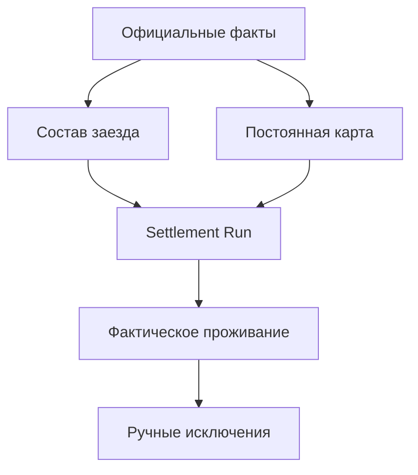
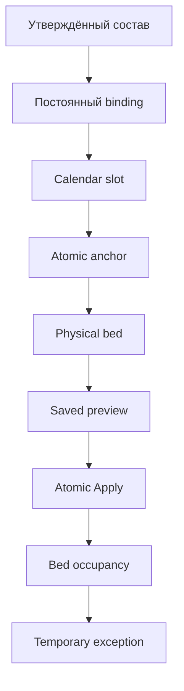

# Целевая архитектура и модель данных

Версия: 0.2
Статус: целевая логическая модель; физическая адаптация уточняется после аудита HEAD

## 1. Архитектурный принцип

Система разделяется на пять независимых слоёв:

1. официальные входные факты;
2. постоянная жилищная карта;
3. план конкретного заезда;
4. фактическое проживание;
5. решения и аудит.

Ни один слой не должен подменять другой. В частности, оперативное назначение на технику не является постоянным жилищным правом, а preview не является фактическим заселением.

## 2. Сохраняемые существующие сущности

Если актуальный код подтверждает их корректность, сохраняются:

- `PhysicalRoom` — физическая комната;
- `PhysicalBed` — физическая койка;
- `SettlementSource` — источник решения;
- `SettlementRevision` — неизменяемая версия источника;
- `AccommodationAnchor` — атомарное жилищное место;
- `AccommodationAnchorBedAssignment` — периодическая связь атомарного места с физической койкой;
- `EmployeeBedOccupancy` — фактическое проживание на конечном интервале.

Сохранение названия не означает сохранение ошибочной семантики. Актуальные constraints и writers должны быть приведены к этой документации.

## 3. Атомарное жилищное место

`AccommodationAnchor` всегда обозначает одно атомарное место, способное одновременно указывать не более чем на одну физическую койку.

Минимально необходимые атрибуты:

| Поле | Смысл |
|---|---|
| `stable_id` | Неизменяемая внешняя идентичность |
| `anchor_type` | `EQUIPMENT`, `FUNCTION`, `GROUP`, `RESERVE`, `SERVICE`, `PROTECTED` |
| `group_key` | Логическая группа, например ID техники или код функции |
| `ordinal` | Номер атомарного места внутри группы; существующее поле HEAD используется повторно |
| `status` | Проект/подтверждено/закрыто |
| `source_revision` | Основание создания или изменения |

Для тяжёлой техники обязательны два атомарных anchor:

- `(equipment_id, ordinal=1)`;
- `(equipment_id, ordinal=2)`.

Они группируются одной техникой, но каждый связан с отдельной койкой. Ограничение «одна техника — один anchor» запрещено.

Аудит HEAD подтвердил, что `Equipment 1:N AccommodationAnchor` уже допускается, а `ordinal` уже существует. Поэтому базовое решение — не добавлять родитель `EquipmentAccommodationPair`, пока реальная потребность не доказана. Пара определяется общей Equipment и двумя active anchors с ordinal 1/2. Бизнес-смысл остаётся: одна техника — пара, пара — два атомарных места.

Необходимые ограничения:

- active equipment anchor имеет заполненный `equipment` и не использует function/group keys;
- для одной Equipment не более одного active anchor каждого ordinal;
- для технической пары разрешены только ordinal 1 и 2;
- подтверждение жилищной карты требует наличия обоих slots;
- обе bed assignments пары ведут в одну room и одинаковый position `n`, но разные blocks A/B.

## 4. Календарный слот атомарного места

Новая логическая сущность `AccommodationAnchorCalendarSlot`:

| Поле | Смысл |
|---|---|
| `anchor_id` | Атомарное жилищное место |
| `rotation_group_id` | Официальная чередующаяся месячная группа |
| `valid_from`, `valid_to` | Период действия календарного слота |
| `status` | Проект/подтверждено/закрыто |
| `source_revision_id` | Основание |

Одна физическая койка может обслуживать календарные слоты разных чередующихся групп, потому что их фактические периоды проживания не пересекаются. Если непересечение не доказано календарём, Apply блокируется.

## 5. Постоянное закрепление сотрудника

Новая сущность `EmployeeAccommodationBinding` хранит постоянное жилищное право:

| Поле | Смысл |
|---|---|
| `employee_id` | Сотрудник |
| `anchor_calendar_slot_id` | Календарный слот атомарного места |
| `valid_from`, `valid_to` | Период действия права |
| `status` | `DRAFT`, `CONFIRMED`, `CLOSED` |
| `basis_type`, `basis_id` | Основание: утверждённый baseline, решение руководителя и т. п. |
| `source_revision_id` | Неизменяемая версия источника |
| `approved_by`, `approved_at` | Подтверждение |
| `supersedes_id` | Предыдущее закрепление при постоянной коррекции |

Инварианты:

- сотрудник не имеет двух пересекающихся подтверждённых binding;
- один календарный слот не имеет двух пересекающихся подтверждённых владельцев;
- временная occupancy не закрывает binding;
- изменение binding выполняется отдельной командой и не маскируется под relocate.

## 6. Состав заезда

Логическая сущность `SettlementCohort` может быть новой таблицей либо адаптером над существующим утверждённым календарём, если HEAD уже содержит полноценный источник.

`SettlementCohort`:

- период;
- календарная группа;
- статус `DRAFT`, `APPROVED`, `SUPERSEDED`;
- номер версии;
- источник;
- автор утверждения;
- отпечаток содержимого.

`SettlementCohortMember`:

- сотрудник;
- `[arrival_at, departure_at)`;
- статус участия;
- причина изменения;
- ожидаемый schedule regime;
- ссылка на официальный источник;
- производственный контекст как snapshot, но не как постоянное право.

## 7. Различие постоянного и оперативного назначения

Для производственных назначений должен существовать доказуемый признак:

- `BASELINE/PERMANENT` — может предложить первичное жилищное закрепление;
- `TEMPORARY/OPERATIONAL` — никогда автоматически не меняет binding.

Допустимы разные технические реализации:

1. `assignment_kind` и период в `EquipmentAssignment`;
2. отдельная опубликованная baseline revision;
3. отдельное подтверждение жилищного binding на основании CrewPlan.

Целевая семантика обязательна независимо от выбранной реализации.

## 8. Фактическое проживание

`EmployeeBedOccupancy` хранит только факт/план фактического проживания на конечном интервале:

| Поле | Смысл |
|---|---|
| `employee_id` | Сотрудник |
| `physical_bed_id` | Койка |
| `starts_at`, `ends_at` | Обязательный конечный интервал |
| `terminated_at` | Отдельный факт досрочного прекращения, не переписывающий исходный план |
| `occupancy_kind` | `BINDING`, `TEMPORARY_OVERRIDE`, `EMERGENCY` |
| `binding_id` | Постоянное основание, если применимо |
| `cohort_member_id` | Строка состава заезда |
| `run_row_id` | Строка Apply, если создано автоматически |
| `source_revision_id` | Основание |
| `created_by` | Автор |

Ключевые решения:

- бессрочный тип `PERMANENT` не используется вместо постоянного binding;
- auto-preview не создаёт `PROPOSED occupancy`;
- предложение хранится в `AutoSettlementRunRow`;
- существующие значения `PERMANENT/TEMPORARY/PROPOSED`, если они есть в HEAD, требуют миграционного аудита, а не слепого продолжения.

## 9. Профиль использования комнаты

Для периода должна существовать подтверждённая политика комнаты — новая сущность либо вычислимый версионируемый профиль:

`RoomUseProfile`:

- room;
- период;
- gender policy;
- schedule regime `EARLY/STANDARD/SPECIAL`;
- organization class `STAFF/CONTRACTOR/MIXED_BY_EXCEPTION`;
- protected/reserve/service flags;
- правило 2+1 и ориентация для технической комнаты;
- источник и ревизия.

Неизвестный применимый профиль блокирует автоматическое заселение.

## 10. Resolver-правила

`SettlementResolverRule` — версионируемая конфигурация категорий без прямой пары техники:

- priority;
- employee predicate;
- target anchor type/group;
- eligible pool;
- hard constraints;
- deterministic ranking;
- период действия;
- source revision.

Правила должны быть данными/конфигурацией, а не цепочкой фамилий и должностей в Python-коде.

## 11. Сохраняемый расчёт

`AutoSettlementRun`:

- cohort/version;
- target period;
- rule version;
- input hash;
- status `CALCULATED`, `STALE`, `APPLYING`, `APPLIED`, `CANCELLED`, `FAILED`;
- calculated_by/at;
- applied_by/at;
- idempotency key и результат Apply.

`AutoSettlementRunRow`:

- employee/cohort member;
- action `KEEP`, `SETTLE`, `SETTLE_NEW_BINDING`, `CONFLICT`;
- proposed binding/anchor/bed;
- snapshot официальных входов;
- reason codes;
- source trace;
- row input hash;
- applied occupancy/binding IDs после Apply.

Строки после расчёта неизменяемы. Новый расчёт создаёт новый run.

## 12. Единый доменный валидатор

Все ручные и автоматические writers используют один набор жёстких правил в двух режимах:

- `PRECHECK` — диагностический, без резервирования;
- `COMMIT` — повторная проверка под блокировками внутри транзакции.

PRECHECK никогда не является разрешительным токеном.

COMMIT проверяет минимум:

- актуальность cohort, binding, room profile, anchor-bed и transfer status;
- пересечение койки;
- пересечение сотрудника;
- пол;
- режим комнаты;
- организационное разделение;
- protected/reserve права;
- календарную группу;
- правило 2+1;
- конкуренцию строк одного run;
- обязательные источники и ревизии.

## 13. Транзакции и конкурентность

Apply выполняется одной транзакцией. Рекомендуемый стабильный порядок блокировок:

1. `AutoSettlementRun`;
2. cohort и его версия;
3. сотрудники по ID;
4. комнаты по ID;
5. койки по ID;
6. anchor/calendar slots/bindings;
7. пересекающиеся occupancies.

После блокировок входы перечитываются и пересчитывается hash. Любое устаревание прекращает транзакцию без частичной записи.

Запрещены writers через `bulk_create`, `QuerySet.update` или обход доменного COMMIT-валидатора для подтверждённых settlement-сущностей.

## 14. Трассировка целевого потока

Это основная вертикаль модуля. Пока любой обязательный переход отсутствует, модуль нельзя считать завершённым.
