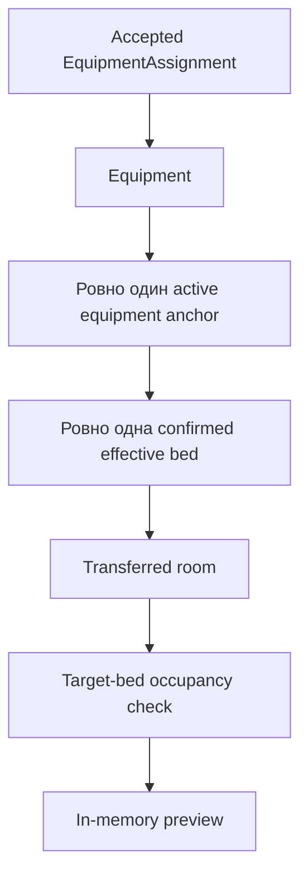

# Текущее состояние реализации settlement

Версия документа: 0.5
Дата последней сверки отчётов: 17.08.2026
Статус: актуализирован по base HEAD `43382d04b0c2d78e8d34e633d1192771bca10657` и принятой локальной реализации M7; migration leaf рабочего дерева — `settlement.0012_m7_saved_previews`
Источники доказательств: модели и domain-код M4–M7, migrations `0008`–`0012`, целевые M7/M6/migration tests и чистый SQLite migration cycle `0011 → 0012 → 0011 → 0012`; production не проверялась и migration `0012` к ней не применялась

## 1. Репозиторий и baseline

### Текущая локальная точка

| Параметр | Значение |
|---|---|
| Проверенный baseline документации v0.4 | `45de5d068f3b8c7f971e6065b974e4857e872f76` |
| Сообщение baseline v0.4 | `docs(settlement): finalize architecture specification v0.4` |
| Служебная синхронизация v0.4 | `31f09903ca8682e9e8635ca1b593e8dbd0d394cf` |
| Предыдущий baseline документации v0.3 | `aba37c44e39b6f6f3bc0ab2caa51d9dae4c4ed9c` |
| Кодовый baseline | `e71dc4e0b7ca26c0402e6e2ac990c8cae5fd1d1b` |
| Текущий HEAD | `dd0459ee39b00a352ef0da0ff647f1d03ad59389` |
| Рабочее дерево | Принятый локальный M4/M5 resident transition: пять modified code/test-файлов и новая migration `0011`; документационная актуализация выполняется поверх него |
| Целевые resident/M4/M5/migration tests | SQLite direct: 57/57 PASS; `--reverse`: 57/57 PASS; migration cycle PASS |
| origin/main | Ahead 25, behind 0; локальная цепочка не опубликована |
| Публикация | Push/merge/deploy не выполнялись |

После прежнего checkpoint реализованы control-контур, M4 calendar slots/bindings (`0008`), M5 authoritative cohorts (`0009`), общий `SettlementResident` (`0010`) и локальный переход subject identity M4/M5 (`0011`). Migration `0011` проверена только в изолированной SQLite-среде и не объявляется применённой к production. Локальная цепочка не опубликована в `origin/main`.

Резервный patch до ADR-014: SHA-256 `8D34729F75247EEFCE37535F35C1CE8D7D0C4D8CC7ABAE3997A956821C6BBC47`.

### Предыдущий clean baseline аудита

| Параметр | Подтверждённое значение |
|---|---|
| Checkout | `C:\Users\swwba\Desktop\Проект учетная система\ПОЕКТ-integration-settlement` |
| Ветка | `main` |
| HEAD | `4df3c6276a8f08b86d86e003e8985aeb3b991c61` |
| origin/main | Совпадает с HEAD |
| Сообщение | `feat(settlement): complete clerk occupancy workflow` |
| Старый контрольный commit | `79bcc7b5d64d64eff97bc5f5365dc06e04806c53` существует |
| Ранее заявленный `0f4c2a1` | Не существует в репозитории |
| Production | В аудите не подключался; совпадение с HEAD не доказано |

Исходный clean baseline аудита — `4df3c62`, а не ранее переданный `0f4c2a1`. Текущая локальная цепочка baseline продолжена commit `e71dc4e0`, документацией v0.3 в commit `aba37c44` и принятым baseline документации v0.4 в commit `45de5d0`; эти commits не опубликованы в `origin/main`.

## 2. Историческое рабочее дерево до нормализации

До commit `e71dc4e0` в рабочем дереве было 11 файлов со статусом `.M`.

Содержательные изменения есть в пяти файлах:

- `backend/settlement/tests.py`;
- `backend/static/css/settlement-clerk.css`;
- `backend/static/js/settlement-clerk.js`;
- `backend/templates/settlement/_room_card.html`;
- `backend/templates/settlement/clerk_map.html`.

Объём содержательного diff: `202 insertions(+), 75 deletions(-)`.

Эти изменения содержали принятую заказчиком UI-итерацию v29, удаление фильтра передачи и дополнительные UI/DnD guards. Они вошли в commit `e71dc4e0` и сохранены в актуальном HEAD.

После scope-сверки 13.08.2026 точный baseline определён так: button styling и обновлённые settlement-summary карточки сохраняются; room-transfer legend, связанный CSS и тесты исключаются; числовое количество переданных комнат сохраняется.

Ещё шесть файлов отмечены изменёнными только из-за LF/CRLF; content hash совпадает с HEAD:

- `assignments/admin.py`;
- `assignments/models.py`;
- `assignments/services.py`;
- `assignments/test_crew_planning.py`;
- `settlement/admin.py`;
- `settlement/models.py`.

Этот dirty state устранён commit `e71dc4e0`. Шесть LF/CRLF-only статусов очищены без содержательных изменений. В итоговом worktree staged, unstaged и untracked изменения отсутствуют.

## 3. Подтверждённые компоненты

| Компонент | Фактическое состояние | Статус относительно цели |
|---|---|---|
| `PhysicalRoom/PhysicalBed` | Физическая карта, A/B/ITR, transfer status, sex restriction | READY/PARTIAL |
| `SettlementSource/SettlementRevision` | Источники и версии с сильной ORM-защитой | READY/PARTIAL |
| `AccommodationAnchor` | Типы equipment/function/reserve/group/service/protected; Equipment→Anchor = 1:N | PARTIAL |
| `AccommodationAnchorBedAssignment` | Версионированная interval-связь anchor→bed; публичные mass-write API запрещены | PARTIAL |
| `EmployeeBedOccupancy` | Canonical интервалы, manual lifecycle; публичные mass-write API запрещены | PARTIAL |
| `SettlementResident` | Единый subject: internal wrapper Employee и внешняя карточка без Employee/Access/Role/PIN | READY |
| `AccommodationAnchorCalendarSlot/EmployeeAccommodationBinding` | M4 реализован; binding ссылается на resident, actor/audit остаются Employee | READY |
| `SettlementCohort/SettlementCohortMember` | M5 реализован; member ссылается на resident, APPROVED overlap проверяется по resident | READY |
| `build_auto_settlement_preview()` | Узкий GET-only in-memory preview по EquipmentAssignment | PARTIAL/CONTRADICTED |
| `settle_employee_on_bed()` | Атомарный ручной writer | PARTIAL |
| `relocate_employee_to_bed()` | Атомарный ручной перенос | PARTIAL |
| release | Досрочное прекращение через `terminated_at` | PARTIAL |
| Карта/панели/drawer/DnD | Рабочий ручной интерфейс | READY/PARTIAL |
| Apply | Endpoint/service/model отсутствуют | ABSENT |
| `SettlementControlLease/SettlementControlEvent` | Schema, migration `0007` и bootstrap FREE singleton присутствуют в репозитории | PRESENT |
| Control lifecycle | Внутренние ensure/acquire/heartbeat/release/expire, HMAC session binding, token/fencing и audit events реализованы | PRESENT |
| Административный takeover | Внутренняя атомарная команда с обязательной причиной и fencing реализована | PRESENT |
| Settlement write gate | Manual writers не проверяют lease token/revision и не используют общий кадровый lock plan | ABSENT |
| Control HTTP/session integration | Endpoints/URLs и хранение lease credentials в пользовательской session отсутствуют | ABSENT |
| Control UI integration | Browser heartbeat, owner indicator, read-only banner и takeover UI отсутствуют | ABSENT |

## 4. Фактическая модель данных

### 4.1. Physical fund

`PhysicalRoom` хранит общежитие, этаж, номер, тип, transfer status, sex restriction, capacity и координаты карты. `PhysicalBed` хранит room, stable ID, block A/B/ITR и position 1..3.

DB гарантирует уникальность комнаты и позиции койки, но не гарантирует равенство числа физических коек полю capacity.

`PhysicalBed.is_available` означает только переданность комнаты, а не фактическую незанятость.

### 4.2. AccommodationAnchor

Одна Equipment уже может иметь два и более active anchor: unique constraint на Equipment отсутствует. Поэтому для целевой пары не требуется ломать FK-cardinality.

Проблема находится в preview: он требует ровно один active equipment anchor и объявляет любое другое количество неоднозначностью.

Текущий anchor семантически является атомарным местом. M4 добавил `AccommodationAnchorCalendarSlot` для конкретного `WatchPeriod`; отдельная модель equipment pair по-прежнему отсутствует и полнота пары `An+Bn` остаётся задачей последующего контура.

### 4.3. Anchor-bed assignment

Штатный `save()` блокирует anchor, затем bed, выполняет `full_clean()` и запрещает interval overlap.

DB-level conditional unique покрывает только открытые confirmed записи `valid_to IS NULL`. Две пересекающиеся конечные confirmed записи можно создать в обход штатного `save()`.

Публичные `bulk_create`, `bulk_update` и `QuerySet.update` запрещены специализированным QuerySet с кодом `anchor_bed_mass_write_forbidden`; normal instance `save()` и draft delete сохранены. Private ORM API, raw SQL и внешний DB-клиент остаются техническими обходами. Удаление confirmed/cancelled записей защищено сигналом. DB-level finite interval overlap ещё не закрыт.

### 4.4. EmployeeBedOccupancy

Поля включают employee, physical bed, тип permanent/temporary/proposed, legacy `settled_at/ended_at` и canonical `starts_at/ends_at/terminated_at`.

Runtime использует единую полуоткрытую семантику:

`starts_at <= moment < min(ends_at, terminated_at)`.

Legacy `ended_at` в runtime activity больше не участвует.

После миграции `0006` DB-level защита overlap bed/employee отсутствует. Модель не имеет FK на cohort, anchor, binding, source, revision или run; отсутствуют reason, release actor и idempotency key. Публичные `update/bulk_create/bulk_update` запрещены специализированным QuerySet с кодом `employee_bed_occupancy_mass_write_forbidden`. Разрешённые `create/save/delete`, private ORM API, raw SQL и внешний DB-клиент всё ещё требуют дисциплины writer/следующих DB-гарантий.

### 4.5. CrewPlan и EquipmentAssignment

`CrewPlan` имеет work date, role, revision, status, version и publication metadata. `CrewPlanSlot` хранит equipment, shift, employee и `baseline_employee`.

`publish_crew_plan()` закрывает старые и создаёт новые accepted `EquipmentAssignment`, но новый EquipmentAssignment не хранит FK на CrewPlan или его ревизию. Provenance публикации теряется.

`EquipmentAssignment` не хранит provenance опубликованного CrewPlan и сам по себе не является сохранённым жилищным основанием. Целевая версия допускает использовать текущий опубликованный контекст только при создании первого binding с обязательным snapshot; такого механизма в HEAD нет.

### 4.6. Вахта и приезд

В upstream уже существуют:

- `WatchComposition`;
- текущая `Employee.watch_composition` без истории;
- `WatchPeriod`;
- `EmployeeShift`;
- `RotationResponse` с arrival/departure/намерением.

M5 использует эти upstream-факты через отдельные `SettlementCohort/SettlementCohortMember`: cohort имеет версию, lifecycle и immutable provenance, а member хранит конкретный resident и конечный интервал участия. Подключение cohort к новому preview ещё не реализовано.

### 4.7. SettlementResident и subject transition M4/M5

`SettlementResident` является единой identity расселения. Тип `EMPLOYEE` имеет защищённую связь с `Employee`; кадровые сведения и принадлежность к `WatchComposition` проверяются по Employee. Типы `CONTRACTOR`, `BUSINESS_TRIP`, `EXTERNAL_OTHER` не имеют Employee и не получают login, PIN, `Role`, `EmployeeAccess` или выдуманную корпоративную composition.

Migration `0011_resident_subject_transition` заменила subject `employee` на `resident` в `EmployeeAccommodationBinding` и `SettlementCohortMember`. Имена моделей сохранены; actor/audit-поля продолжают ссылаться на `Employee`. Binding overlap, correction и supersede, а также member uniqueness и overlapping APPROVED memberships используют `resident_id`.

Forward migration создаёт или переиспользует ровно один внутренний wrapper для существующих subject Employee и не создаёт `EmployeeAccess`. Reverse восстанавливает Employee subject только для internal resident и останавливается fail-closed при external subject. M4/M5 domain-команды используют полный порядок `Employee внутренних resident по PK → SettlementResident по PK с OF self → WatchPeriod → Cohort/Member → Slot/Binding → Anchor/Assignment/Bed → revalidation/write`.

Внешний resident уже может быть subject cohort member и calendar binding. Минимальное безопасное read-only ядро M6 и сохраняемый immutable preview M7 реализованы. Не реализованы: UI создания внешней карточки, UI preview/confirm, Apply, external occupancy и trainee adapter.

### 4.8. Read-only resolver M6

`resolve_settlement_cohort(*, cohort_id)` возвращает immutable deterministic placements/unresolved и fingerprint без ORM writes. Для внутреннего resident порядок волн: `CONFIRMED binding → EquipmentAssignment → PersonnelPosition → controlled unresolved`.

Equipment route применяет официальный selection contract: `ACCEPTED`, заполненная `role`, отсутствующая `shift`, `assigned_at` не позже начала WatchPeriod, `accepted_at` отсутствует либо уже наступила, `ended_at` отсутствует либо ещё не наступила. Полная цепочка: `SettlementResident/Employee → EquipmentAssignment → active Equipment → единственный active equipment AccommodationAnchor → единственный effective CONFIRMED AnchorBedAssignment → CONFIRMED CalendarSlot того же WatchPeriod → PhysicalBed`.

Binding имеет приоритет над equipment route, equipment route — над position route. Множественные assignment/anchor/bed assignment не разрешаются первой строкой. DAY/NIGHT остаётся provenance/compatibility context и не создаёт две identity койки; равноправная конкуренция двух resident за одну bed возвращает `hard_rule_conflict`. Fingerprint включает assignment, equipment, anchor, anchor-bed assignment, slot и bed relations.

## 5. Фактическая трассировка preview

Preview не использует WatchComposition, WatchPeriod, RotationResponse, CrewPlan provenance, постоянный binding, пол, room sex restriction, room type, работодателя, режим комнаты или 2+1.

Scope содержит только effective `EquipmentAssignment` со статусом accepted, заполненной ролью, без operational `EmployeeShift` FK и с подходящим assigned/accepted/ended interval.

Следствия:

- сотрудники без техники, ИТР, службы, reserve/protected/group не входят;
- сотрудник может попасть в preview, даже если фактически не заезжает;
- временная производственная перестановка может быть ошибочно воспринята как жилищное основание;
- календарная группа игнорируется.

## 6. Главная доказанная ошибка preview

Preview группирует конкуренцию по `(physical_bed_id, shift_type)`. Поэтому DAY и NIGHT одной техники могут получить одну PhysicalBed и обе строки будут считаться успешными.

Это противоречит утверждённой физической модели:

- одной машине соответствует пара `An + Bn`;
- работники противоположных смен занимают разные койки пары;
- A/B не означают DAY/NIGHT;
- одновременно отдыхающие три человека распределяются по комнате 2+1.

Текущий manual writer запрещает обычное интервальное занятие одной bed двумя сотрудниками. Следовательно, preview способен вернуть результат, который невозможно корректно применить существующим writer.

Это не отсутствие отдельной проверки, а фундаментальное противоречие алгоритма целевой модели.

## 7. Ручной контур

### Settle

- одна transaction;
- lock Employee → target Bed → Room → связанные occupancies;
- проверяются active employee, transferred room, sex, interval и overlap;
- создаётся occupancy;
- idempotency и provenance отсутствуют.

### Relocate

- одна transaction;
- требует ровно одну active occupancy;
- неблокирующее discovery только ID текущей occupancy/source bed;
- lock Employee → beds по PK → rooms по PK → related occupancies по PK;
- `FOR UPDATE OF` ограничен базовой таблицей каждого набора и не блокирует joined room/dormitory/bed;
- после блокировок повторно проверяются current occupancy, source bed, active interval и conflicts;
- закрывает старую запись через `terminated_at` и создаёт новую;
- mutual A→B/B→A и pairwise manual-writer matrix проверены на PostgreSQL 14.24 без `40P01`, `55P03` и HTTP 500.

### Release

- одна transaction;
- заполняет `terminated_at`;
- actor/reason/source/revision не сохраняются.

### Общая оценка

Штатные ручные writers атомарны, используют согласованный порядок Employee → Beds → Rooms → Occupancies и закрыты от публичных массовых ORM-изменений. Глобального DB interval-инварианта и полного typed COMMIT contract всё ещё нет; writer вызывает только SET-R033/SET-R034 overlap subset.

### Исключительность управляющего

Текущий `settlement_clerk_access_from_request()` проверяет session `employee_access_id`, активность `EmployeeAccess`/Employee/Role и допускает к settlement роли `settlement_clerk` и `admin`. `role_session_state()` ограничивает активную роль внутри одной сессии/сотрудника, но не между разными сотрудниками и устройствами. В schema уже существуют singleton `SettlementControlLease`, session hash, token и fencing revision, а внутренние lifecycle/takeover команды меняют их атомарно и создают `SettlementControlEvent`.

Однако runtime HTTP-контур не вызывает эти команды: manual POST по-прежнему напрямую запускает `settle_employee_on_bed()`, `relocate_employee_to_bed()` или `release_employee_from_bed()` без write gate. Control endpoints/URLs, хранение credentials в пользовательской session и UI отсутствуют. Кроме того, общий порядок `Lease → все Employee → все EmployeeAccess → доменные строки` ещё не реализован: acquire/takeover используют существующий access-root lock и должны быть приведены к утверждённому кадровому префиксу до подключения gate.

Следствия для runtime в implementation baseline `902e3886`:

- два разных делопроизводителя либо делопроизводитель и администратор могут одновременно пройти серверную авторизацию;
- две вкладки/два HTTP-запроса одного пользователя могут выполняться параллельно;
- кадровый график, `WatchComposition`, `WatchPeriod` и открытая смена не являются precondition ручного POST writer;
- background Apply отсутствует, но будущий Apply без общего control gate создал бы дополнительный конкурентный writer;
- schema/lifecycle/takeover доступны только как внутренний сервисный контур и пока не дают пользователю техническую исключительность управления.

## 8. UI и HTTP

- `/clerk/` и `/clerk/settlement/` используют один map view;
- preview — только GET `preview=1`;
- результат живёт только в context response;
- кнопки Apply и Apply route нет;
- POST endpoint поддерживает только `settle`, `relocate`, `release`;
- CSRF включён;
- непереданный destination закрыт UI и server writer;
- в чистом HEAD занятую койку непереданной комнаты можно визуально начать тащить как source, но destination и server закрыты;
- принятая v29 добавляет дополнительные guards и cache-buster v29;
- изменения v29 зафиксированы локальным commit `e71dc4e0`; dirty UI-worktree устранён.

## 9. Актуальные проверки

| Набор | Команда | Результат | Ограничение |
|---|---|---|---|
| Settlement SQLite после takeover | `python manage.py test settlement --verbosity 1 --noinput` | 324 PASS, 8 PostgreSQL-only skip | Последний подтверждённый локальный полный settlement suite |
| Settlement PostgreSQL 14.24 после takeover | та же команда с изолированным PostgreSQL profile | 332/332 PASS | Последний подтверждённый полный settlement suite и concurrency |
| Mutual relocate | PostgreSQL TransactionTestCase, три последовательных запуска | 1/1 PASS каждый | Barrier/timeouts; mutation старого порядка воспроизводит `40P01` |
| Pairwise manual writers | relocate/relocate, settle/relocate, relocate/release, settle/settle | PASS | Нет `40P01`, `55P03`, HTTP 500 и двойной occupancy |
| Resident/M4/M5/migration SQLite | четыре целевых класса direct и `--reverse` | 57/57 PASS в каждом порядке | Не является полным settlement suite |
| Migration `0011` cycle | чистая временная SQLite DB: `0010 → 0011 → 0010 → 0011` | PASS | Временная БД удалена; production не затрагивалась |
| Migration drift | `makemigrations --check --dry-run` | Изменений нет | Leaf `settlement.0011_resident_subject_transition` соответствует model state |

После PostgreSQL-проверок test database удалялась. Эти результаты относятся к изолированным локальным средам и не доказывают применение migration `0007` к production.

## 10. Матрица относительно целевой архитектуры

| Целевой элемент | Статус | Фактический разрыв |
|---|---|---|
| Physical A1–A3/B1–B3 | READY | Физический stable fund представлен |
| Непереданный фонд закрыт | READY | Preview/manual destination guards существуют |
| AccommodationAnchor как atomic identity | PARTIAL | Нет строгой type-shape/capacity/calendar semantics |
| Два atomic anchor одной Equipment | CONTRADICTED | Schema допускает, preview требует ровно один |
| Equipment pair `An+Bn` | ABSENT | Нет pair/slot semantics и validation |
| Anchor-bed interval integrity | PARTIAL | Normal save и публичный QuerySet guard защищают; private/raw и DB-level finite interval overlap остаются |
| Authoritative SettlementCohort | READY | M5 cohort/member, lifecycle, immutable provenance и resident identity реализованы migration `0009/0011` |
| AccommodationAnchorCalendarSlot | READY | M4 concrete WatchPeriod slot, boundaries/stale/overlap guards реализованы migration `0008` |
| EmployeeAccommodationBinding | READY | Subject — `SettlementResident`; прямого subject-FK Employee нет; actor/audit остаются Employee |
| Initial-binding provenance snapshot | READY/PARTIAL | Binding хранит immutable basis/source snapshot; автоматическое создание из будущего Apply отсутствует |
| Конечная factual occupancy | PARTIAL | Интервалы есть; provenance/DB overlap отсутствуют |
| Room profiles | PARTIAL | transfer/sex/type есть; M6 умеет безопасно вычислить внешний residual pool только из подтверждённых M4 evidence; persistent режим и 2+1 отсутствуют |
| Rule 2+1 | ABSENT | Нет нормативно однозначной модели/конфигурации; read-only resolver возвращает `resolver_not_configured` |
| M6 resolver | READY/PARTIAL | Минимальное MVP-ядро COMPLETE: binding → equipment assignment → position → controlled unresolved; persistent RoomUseProfile/ResolverRule и специальные волны ещё отсутствуют |
| Explicit category assignments | ABSENT | Нет версионируемого назначения RESERVE и аналогичных категорий |
| Trainee structured-state route | ABSENT | Существующий authoritative trainee state/adapter не найден; Vacancy исключена ADR-030 |
| Authoritative SettlementResident | READY | Migration `0010_settlement_residents` ввела resident lifecycle; migration `0011_resident_subject_transition` перевела M4 binding и M5 member на resident identity без создания EmployeeAccess |
| Group capacity conflict | PARTIAL | M6 read-only resolver не выбирает равноправного resident при дефиците и возвращает всей непосредственно конфликтующей группе `equal_priority_conflict`; полный configured group resolver ещё отсутствует |
| Explicit KEEP | PARTIAL | Совпадение employee допускается, action/provenance нет |
| Saved preview M7 | READY | `SettlementPreviewRun` с version и lifecycle `DRAFT → CONFIRMED → SUPERSEDED`; один CONFIRMED на WatchPeriod |
| Immutable run rows | READY | Отдельные `SettlementPreviewPlacement` и `SettlementPreviewUnresolved`, immutable provenance и public mass-mutation guards |
| Input hash/stale detection | READY | Resolver/normalized fingerprints, source snapshot, повторный M6 при confirmation и read-only stale helper |
| Transactional Apply | ABSENT | Endpoint/service отсутствуют |
| Idempotency | ABSENT | Отсутствует |
| Единственный активный управляющий | PARTIAL | Singleton lease, lifecycle и fencing реализованы внутренне; write gate, HTTP/session binding и server read-only enforcement отсутствуют |
| Административный takeover | PARTIAL | Внутренняя команда реализована; endpoint, UI подтверждения и fencing действующих manual writers отсутствуют |
| Единый полный COMMIT validator | PARTIAL | Подключены только overlap rules |
| Temporary manual exception | PARTIAL | Temporary/relocate/release есть; binding/reason нет |
| Permanent binding correction | READY | Correction/supersede реализованы по resident identity с сохранением истории |

## 11. Решение архитектора

Строить Apply поверх текущего preview запрещено.

Сохраняются:

- physical fund и карта;
- source/revision;
- anchor как атомарная идентичность;
- anchor-bed history после усиления инвариантов;
- canonical occupancy interval;
- manual writers после унификации validator/locks/audit;
- CrewPlan, WatchComposition/WatchPeriod и RotationResponse как upstream-факты;
- UI-каркас, панели и DnD.

До полного Apply необходимы либо остаются отдельными конфигурационными этапами:

1. усиление текущих interval/writer invariants;
2. два atomic equipment slots и validation пары `An+Bn`;
3. ~~calendar slots~~ — реализованы M4;
4. ~~permanent resident binding~~ — реализован M4 и переведён на `SettlementResident` migration `0011`;
5. ~~authoritative versioned cohort~~ — реализован M5 и переведён на `SettlementResident` migration `0011`;
6. snapshot первичного CrewPlan/EquipmentAssignment при создании binding;
7. явные category assignments и маршрут стажёра по настоящей должности через authoritative structured state/adapter;
8. room profiles, resolver rules и групповые конфликты дефицита.

Saved preview M7 уже построен и подтверждается без occupancy writes. Следующий активный milestone — transactional Apply актуального `CONFIRMED` preview; специальные M6-конфигурации продолжают возвращать controlled unresolved и не должны маскироваться Apply.

### 11.1. Фактический M7

Migration leaf — `settlement.0012_m7_saved_previews`. Migration schema-only, зависит от `settlement.0011_resident_subject_transition`, не выполняет backfill и создаёт три M7-таблицы. Публичные API: `create_settlement_preview_run(*, cohort_id, control_context)`, `confirm_settlement_preview_run(*, run_id, control_context)` и `settlement_preview_is_stale(*, run_id)`.

Подтверждение требует exact server-side control context, повторяет M6 и fail-closed сравнивает fingerprints/snapshot/rows. Unresolved residents сохраняются с reason codes и допускаются в `CONFIRMED` preview. M7 не меняет occupancy, M4/M5, residents или физический фонд. Apply, UI и production deployment отсутствуют.
